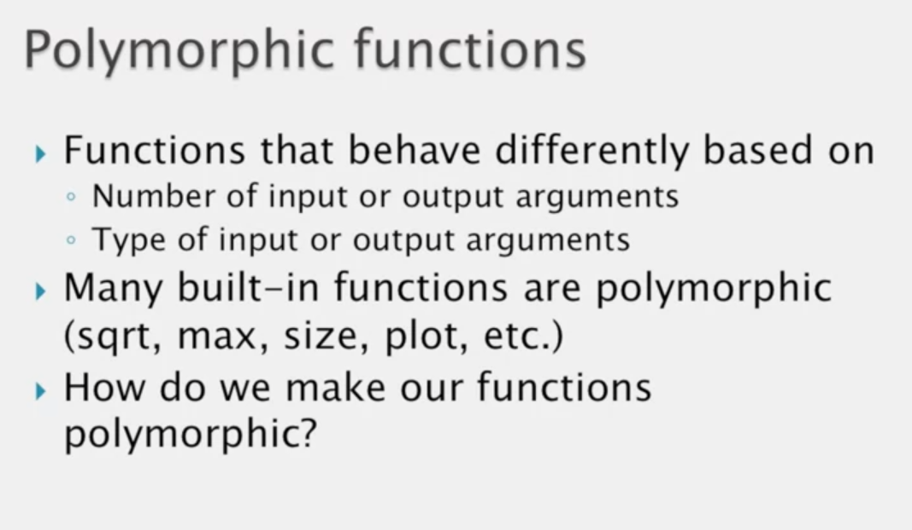
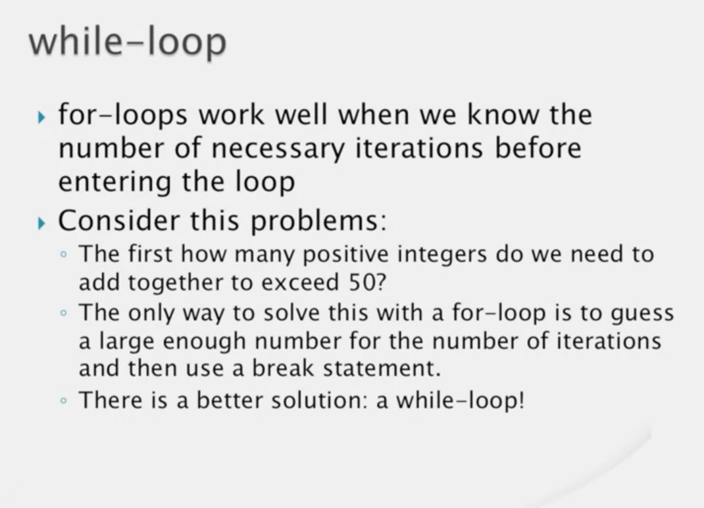
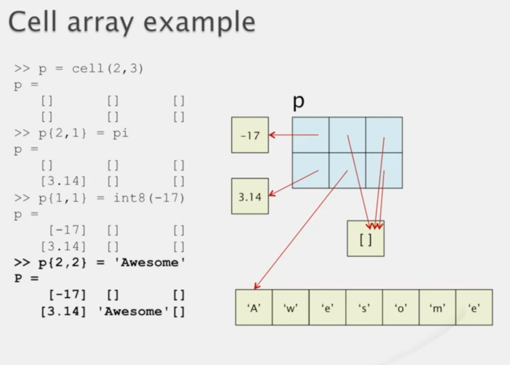

## Module 5

### Introduction to Programmer's Toolbox

- polymorphism


### Matrix Building

```MATLAB
>>zeros(5,6)
>>ones(4,2)
>>5 + ones(4,2)
>>zeros(4)
>>diag([7 3 9 1])
>>rand
>>rand(3,4)
>>rand(5)
>>1 + rand(5,4) * 10
>>fix(1 + rand(5,4) * 10)
>>randi(10,5,4)
>>randi(20, 5)
>>randi([5 10],2, 3)
>>randn(5)
>>r = randn(1, 1000000);
>>hist(r,100)
```


```MATLAB
>>rng(0);
>>rand(1,3)
>>rng(1)
>>[rand, randnm, randi(10)]
>>rng('shuffle');[rand, randnm, randi(10)]
```

### Input / Output

```MATLAB
>>edit one_more
```

```MATLAB
function a = one_more
x = input('Gimme a number, buddy: ');
a = x + 1;
```

```MATLAB
>>fprintf('This concludes lesson 3\n')
```

```MATLAB
function check_out(n, price)
    total = n * price;
    fprintf('%d items at %.2f each\nTotal = $%5.2f\n',n,price,total);
end
```

`\` and `%` are called escape character.

```MATLAB

fprintf('12.5%% of 1234 equals %.3f\n', 0.125*1234)
fprintf('This is a backslash character: \\\n')
fprintf('How about a single quote ('')?\n')
```

```MATLAB

fprintf('%d lb butter, %d tbsp cocoa, %d cps flour, and %d cps sugar\n', 1, 8, 4, 4)
```

If we miss a value in `fprintf` less the the `%` sign it will print till the `%` sign

If we have extra value than the `%` sign it will repeat from the beginning like circular.

```MATLAB
>>fprintf('%4.1f\n', [1 2 3 4 5 6]);
```

### Plotting

```MATLAB
>>a= [1:10].^2
>>plot(a)
>>figure(2);
>>a= [-10:10].^2
>>plot(a)
>>t=-10:10
>>b=t.^2
>>figure
>>plot(t,b);
```

```MATLAB
>>x1 = 0:0.1:2*pi; y1=sin(x1);
>>x2 = pi/2:0.1:3*pi; y2=cos(x2);
>>plot(x1,y1,x2,y2)
>>figure
>>plot(x1,y1,'r',x2,y2,'k:')
```

```MATLAB
>>figure(1)
>>plot(t,b,'m--o')
```

```MATLAB
>>figure(2)
>>plot(x1, y1,'r')
>>hold on
>>plot(x2, y2,'k:')
>>hold off
>>plot(x1,y1,'g*')
>>figure(3)
>>grid
>>title('A sine Plot and a cosine Plot');
>>xlabel('The argument of sine and cosine')
>>ylabel('The value for sine or cosine')
>>legend('sine','cosine')
>>axis([-2 12 -1.5 1.5])\
>>close(4)
>>close all
```

### Debugging


## Module 6

### Selection


```MATLAB
function guess_my_number(x)
    if x == 2
        fprintf('Congrats! You guessed my number!\n');
    end
end
```


```MATLAB
function guess_my_number(x)
    if x == 2
        fprintf('Congrats! You guessed my number!\n');
    else
        fprintf('Not right, but a good guess.\n');
    end
end
```

```MATLAB
function guess_my_number(x)
    if x == 42
        fprintf('Congrats! You guessed my number!\n');
    elseif x < 42
        fprintf('Too small. Try again\n');
    else
        fprintf('Too big. Try again.\n');
    end
end
```

```MATLAB
function day_of_week(n)
    if n == 1
        fprintf('Sunday,');
        day_type=2;
    elseif n == 2
        fprintf('Monday,');
        day_type=1;
    elseif n == 3
        fprintf('Tuesday,');
        day_type=1;
    elseif n == 4
        fprintf('Wednesday,');
        day_type=1;
    elseif n == 5
        fprintf('Thursday,');
        day_type=1;
    elseif n == 6
        fprintf('Friday,');
        day_type=1;
    elseif n == 7
        fprintf('Saturday,');
        day_type=2;
    else
        fprintf('Number must be from 1 to 7.\n');
        return
    end

    if day_type == 1
        fprintf(' which is a week day\n');
    else
        fprintf(' which is a weekend day\n');
    end
end
```


### Relational and Logical Operators


```MATLAB
>> 10 == 20
>> 3 == (35-32)
>> x = (16 * 64 > 1000) + 9
>> x = 16 * 64 > 1000 + 9
```

```MATLAB
function if_test(x)
    if x
        fprintf('%d is true!\n', x);
    else
        fprintf('%d is false!\n',x);
    end
end
```

```MATLAB
>> [4 -1 7 5 3] .* [5 -9 6 5 -3]
>> [4 -1 7 5 3] > [5 -9 6 5 -3]
>> [4 -1 7 5 3] <= 4
>> sum([14 9 3 14 8 3] == 14)
```


```MATLAB
function a = order3(x,y,z)
    if x <=y && y <= z
        a = 1;
    elseif x >= y && y >= z
        a = -1;
    else
        a = 0;
    end
end
```

```MATLAB
function a = not_smallest(x,y,z)
    if x >= y || x >= z
        a = 1;
    else
        a= 0;
    end
end
```

```MATLAB
>> 1 && 2
>> pi && -1234
>> 0 && 1
>> 23 && 0
>> 0 & 0
>> 1 || 2
>> pi || -1234
>> 0 || 1
>> 23 || 0
>> 0 || 0

>> a = 1
>> b = 2
>> c = 0
>> d = ~(a && b) || (b && c)
>> d = ~(a && b) || (b || c)

>> b * (0<b && b<10)

>> total = 0
>> b = 5;
>> total = total + b * (0 < b && b < 10)
>> b = 3;
>> total = total + b * (0 < b && b < 10)
>> b = 11;
>> total = total + b * (0 < b && b < 10)

>> [1 pi 0 -2]
>> ~[1 pi 0 -2]

>> [1 -3 0 9 0] && [pi 0 0 2 3]  % gives error

>> [1 -3 0 9 0] & [pi 0 0 2 3]

>> [1 -3 0 9 0] | [pi 0 0 2 3]

>> 2 & [0 1; 2 3]
>> 2 | [0 1; 2 3]

>> 1.4 < sqrt(2) & [pi >3 -1 > 1 ]

>> (1.4 < sqrt(2)) & [pi >3 -1 > 1 ]

>> 1.4 < (sqrt(2) & [pi >3 -1 > 1 ])
```


### Nested If-Statements


### Variable Number of Function Arguments




```MATLAB
function [table, summa] = multable(n, m)
    if nargin < 2
        m = n;
    end
    
    table = (1:n)' * (1:m);
    
    if nargout ==2
        summa = sum(table(:));
    end
end
```

### Robustness


```MATLAB
function [table, summa] = multable(n, m)

%MULTABLE multiplication table.
% T = MULTABLE(N) returns an N-by-N matrix
% containing the multiplication table for
% the integers 1 through N.
% MULTABLE(N,M) returns an N-by-M matrix.
% Both input arguments must be positive
% integers.
% [T SM] = MULTABLE(...) returns the matrix
% containing the multiplication table in T
% and the sum of all its elements in SM.

    if nargin < 1
        error('must have at least one input argument');
    end
    if nargin < 2
        m = n;
    elseif ~isscalar(m) || m < 1 || m ~= fix(m)
        error('m needs to be a positive integer');
    end
 
    if ~isscalar(n) || n < 1 || n ~= fix(n)
        error('n needs to be a positive integer');
    end
    
    table = (1:n)' * (1:m);
    
    if nargout ==2
        summa = sum(table(:));
    end
end
```

### Persistent Variables


```MATLAB
function total = accumulate(n)
    persistent summa;
    if isempty(summa)
        summa = n;
    else
        summa = summa + n;
    end
    total = summa;
end
```

```MATLAB
>> accumulate(3)
>> accumulate(5)
>> accumulate(10)
>> accumulate(-11)
>> accumulate(-20)
>> clear accumulate
>> accumulate(17)
```

```MATLAB
function [table, summa] = snarky_multable(n, m)

%MULTABLE multiplication table.
% T = MULTABLE(N) returns an N-by-N matrix
% containing the multiplication table for
% the integers 1 through N.
% MULTABLE(N,M) returns an N-by-M matrix.
% Both input arguments must be positive
% integers.
% [T SM] = MULTABLE(...) returns the matrix
% containing the multiplication table in T
% and the sum of all its elements in SM.

    persistent error_count;
    if isempty(error_count), error_count = 0;end % no errors yet
    if nargin < 1
        error('must have at least one input argument');
    end
    if nargin < 2
        m = n;
    elseif ~isscalar(m) || m < 1 || m ~= fix(m)
        error_count = error_count + 1;
        if error_count < 3, error('m needs to be a positive integer'); end
    end
 
    if ~isscalar(n) || n < 1 || n ~= fix(n)
        error_count = error_count + 1;
        if error_count < 3, error('n needs to be a positive integer'); end
    end

    if error_count >= 3
        error_count = 0;
        error('What part of "positive integer" do you not understand?');
    end
    
    table = (1:n)' * (1:m);
    
    if nargout ==2
        summa = sum(table(:));
    end
end
```

```MATLAB
>> snarky_multable(4.5)
>> snarky_multable(3.5)
>> snarky_multable([7 8])
```

## Module 7

### For-Loops


```MATLAB
function sumintup(N)
    total = 0;
    for n = 1:N
        total = total + n;
    end
    fprintf('total equals %d\n', total);
end
```


```MATLAB
function rand_check
    N = 5;
    list = rand(1,N); % assigns a row vector of random numbers
    for x = list
        if x > 0.5
            fprintf('Random number %f is large.\n',x)
        else
            fprintf('Random number %f is small.\n',x)
        end
    end
end
```


```MATLAB
function loop_test(N)
    total = 0;
    for n = 1:N
        n
        n = n + 1;
        total = total + n;
    end
    fprintf('Total: %d\n', total);
end
```

```MATLAB
>> u = [5 4 8 8 2];
>> v = [5 5 7 8 8];
>> w = u - v
>> for ii = 1:length(u)
w(ii) = u(ii) - v(ii);
end
>> w
```

```MATLAB
function f = fibo(n)
    if (~isscalar(n) || n < 1 || n ~= fix(n))
        error('n must be a positive integer!');
    end
    f(1) = 1;
    f(2) = 1;
    for ii = 3:n
        f(ii) = f(ii-2) + f(ii-1);
    end
end
```

```MATLAB
>> A = randi(10,3,4)
>> P = A.*A
```

```MATLAB
[row, col] = size(A);
for r = 1:row
    fprintf('Working on row %d...\n',r);
    for c = 1:col
        P(r,c) = A(r,c) * A(r,c);
        fprintf('(%d %d)\n',r,c);
    end
end
```

```MATLAB
N = 7;
for mm = 1:N
    for nn = 1:mm
        fprintf('*');
    end
    fprintf('\n');
end
```

### While-Loops




```MATLAB
function [n, total] = possum(limit)
    total = 0;
    n = 0;
    while total <= limit
        n = n + 1;
        total = total + n;
    end
    fprintf('sum: %d count: %d\n', total, n);
end
```

```MATLAB
function y = approx_sqrt(x)
y = x;
    while abs(y^2 - x) > 1e-7 * x
        y = (x/y + y)/ 2;
    end
end
```

### Break Statements

```MATLAB
%% Examples of skipping remainder of iterations

%% Example 1
% Skipping is accomplished in the while condition.
ii = 1;
while ii < length(readings) && readings(ii) <= 100
    readings(ii) = 0;
    ii = ii + 1;
end

%% Example 2
% Skipping is acomplished with a break statement.
for ii = 1:length(readings)
    if readings(ii) > 100
        break;
    else
        readings(ii) = 0;
    end
end

%% Example 3
% Shows that for-loop index retains is last value
% after the loop is exited. It's similar to Example 2,
% but omits the setting of values to 0 and prints the
% index of the first reading above 100.
for ii = 1:length(readings)
    if readings(ii) > 100
        break;
    end
end
fprintf('First reading above 100 is at index %d.\n', ii);

```

```MATLAB
>>  rng(0);readings = randi(105,1,20)


rng(0);A = randi(99,5,8)
```

`BadBreak.m`
```MATLAB
for ii = 1:size(A,1)
    for jj = 1:size(A,2)
        if A(ii,jj) <= 90
            A(ii,jj) = 0
        else
            break;
        end
    end
end
```
`GoodBreak.m`
```MATLAB
found = false;
for ii = 1:size(A,1)
    for jj = 1:size(A,2)
        if A(ii,jj) <= 90
            A(ii,jj) = 0;
        else
            found = true;
            break;
        end
    end
    if found
        break;
    end
end
```

### Logical indexing


```MATLAB
>> [4 -1 7 5 3] > [5 -9 6 5 -3]
>> c = [2>1, 2<1, ~(3>2 && 4>5)]
>> holmes = logical([1 -2 0 0 9.12 -2])
>> a = 1:3
>> a(c)
>> rng(0);
>> r = randi(10,1,6)
>> holmes
>> r(holmes)
>> v = [56, 34, -2, 7, 29, 53, 30, -3, 5, 45]
>> keepers = v >= 0
>> w = v(keepers)
>> w = v(v >= 0)
>> confidence = [100, 97, 11, 12, 76, 76, 80, 9, 4, 98]
>> v_10 = v(confidence >= 10)
>> v_20 = v(confidence >= 20)
>> v0 = [50 35 -8 5 30 49 30 0 10 50]
>> v_bigger = v(v > v0)
>> v
>> v(v<0)=0 %% changes the array
>> v = [56, 34, -2, 7, 29, 53, 30, -3, 5, 45]
>> v(v<0) = [100, 200]
>> v = [56, 34, -2, 7, 29, 53, 30, -3, 5, 45]
>> v(v<0) = v(v<0) + 100
>> A = [1 2 3;4 5 6]
>> B = A(A>2)
>> A
>> A_column_major = A(:)
>> A_column_major(A_column_major>2)
>> B = A(A>0)
>> rng(0); A = randn(5)
>> A(A<0) = 0
>> rng(0); A = randn(5)
>> A(A<0) = 101:108
>> rng(0); A = randn(5);
>> A(A<0) = (101:108)'
>> A(A > 0.1) = 101:107
>> rng(0); A = randn(5);
>> A(A > 0.1) = sqrt(A(A > 0.1))
>> A = [89 82 11 53; 33 5 59 42]
>> B = [34 44 52 64; 62 73 58 99]
>> A((A>B)) = A(A>B) - B(A>B)
```

### Preallocation

```MATLAB
>> tic; sum(1:1e3) ; toc
>> tic; sum(1:1e6) ; toc
>> tic; sum(1:1e8) ; toc
>> tic; sum(1:1e3) ; toc
```

```MATLAB
function noprealloc
    N = 5000;
    for ii = 1:N
        for jj = 1:N
            A(ii, jj) = ii * jj;
        end
    end
end
```

```MATLAB
>> tic; noprealloc; toc
```

```MATLAB
function prealloc
    N = 5000;
    A = zeros(N,N);
    for ii = 1:N
        for jj = 1:N
            A(ii, jj) = ii * jj;
        end
    end
end
```

```MATLAB
>> tic; prealloc; toc
```

- Memory alloacation takes time

## Module 8

### Introduction to Data Types


```MATLAB
>> clear
>> x = 23
>> class(x)
>> class(0)
>> class(sqrt(-1))
>> y = 1:8
>> rng(0); z = rand(3,4)
>> whos
>> ans
>> class('Sup?')
>> class(3 < 4>)
```


```MATLAB
>> x = single(98.76)
>> n = int8(-16)
>> m = uint16(1234)
>> whos
>> k = uint8(500)
>> k = uint8(256)
>> k = unit8(-1)
>> class(k)
>> k = 2
>> class(k)
>> k = 'It makes sense.'
>> class(k)
>> clc
>> intmax('uint8')
>> intmin('uint8')
>> intmin('uint32')
>> intmin('int32')
>> realmax('double')
>> realmin('single')
```

### Strings


```MATLAB
function char_codes
for ii = 33:126
    fprintf('%s',ii);
end
fprintf('%s',10); % new line character
```
```MATLAB
>> MOOC_title = 'MATLAB for Smarties'
>> length(MOOC_title)
>> MOOC_title(1)
>> MOOC_title(1:6)
>> MOOC_title(end-8:end)
>> txt1 = 'colonel'
>> txt2 = 'kernel'
>> txt1 == txt2 % gives error
>> a = MOOC_title(1:6)
>> b = a(end:-1:1)
>> a == b
>> clc
>> message = 'Let''s skip class today!'
>> code = double(message)
>> secret = char(code + 3)
>> secret
>> char(secret - 3)
>> friends = ['Bill'; 'Mary'; 'John']
>> line1 = '12345678'
>> line2 = 'abcdefgh'
>> txt = [line1; line2]
>> txt'
>> poem = ['TIGER, tiger, burning bright'; 'In the forests of the night'] % gives error
>> 
```


```MATLAB
>> MOOC_title
>> findstr(MOOC_title, 'LAB')
>> findstr(MOOC_title, 'lab')
>> findstr('Team', 'I')
>> findstr(MOOC_title, 'r')
>> lang = 'MATLAB'
>> strcmp(MOOC_title, lang)
>> strcmp(MOOC_title(1:6), lang)
>> strcmpi(MOOC_title(1:6), 'Matlab') % ignores case
>> pi_number = 3.1416
>> pi_digits = '3.1416'
>> size(pi_number)
>> size(pi_digits)
>> class(pi_number)
>> class(pi_digits)
>> pi_number + 1
>> pi_digits + 1 % mixed mode arithmetic
>> double(pi_digits) + 1
>> double(pi_digits)
>> str2num(pi_digits)
>> str2num(pi_digits) + 1
>> num2str(pi_number)
>> ans + 1
>> clc
>> r = 12
>> fprintf('The area of a circle with radius %.2f is %.2f!\n', r, pi*r^2);
>> sprintf('The area of a circle with radius %.2f is %.2f!\n', r, pi*r^2);
>> str = sprintf('The area of a circle with radius %.2f is %.2f!\n', r, pi*r^2);
>> str
>> class(str)
```

### Structs


```MATLAB
>> account.number = 1234567
>> account.balance = 5000
>> account.owner.name = 'Joe Smith'
>> account.owner.email = 'joe@matlabmooc.com'
>> class(account)
>> class(account.number)
>> class(account.balance)
>> class(account.onwer)
>> account.owner
>> account(2).number = 7654321
>> account(2).owner
>> account(2).balance
>> account(2).balance = 1000
>> account(2).owner.name = 'Jane Farmer'
>> account(1)
>> account(2)
>> account(2).owner.name
>> account(1).owner.name
>> length(account(1).owner.name)
>> length(account(2).owner.name)
>> account(1).owner.age = 23
>> account(2).owner.age % gives error
>> clc
>> account(1:2).owner
>> isfield(account(2).owner,'age')
>> isfield(account(1).owner,'age')
>> rmfield(account(1).owner,'age')
>> account(1).owner
>> account(1).owner = rmfield(account(1).owner,'age')
>> account(1).owner
>> course = struct('Area', 'CS', 'number', 103, 'title', 'Introductory Programming for Engineers and Scientists')
```

### Cells


```MATLAB
%% The Ultimate Legend of Big John
page{1} = 'You could find him on the field almost any day.';
page{2} = 'Tall, dark hair, and eyes of steel gray.';
page{3} = 'They say he pulled a Frisbee ''bout half a mile,';
page{4} = 'And when he''d stick in the corner, you could almost catch a smile';
page{5} = 'On Big John.';
%% Print it
fprintf('\n');
for ii = 1:length(page)
    fprintf('%s\n',page{ii});
end
fprintf('\n');
```

```MATLAB
>> whos
>> page{1}
>> page{2}
>> class(page)
>> class(page{1})
>> size(page{1})
>> class(page{4})
>> size(page{4})

```




```MATLAB
>> c{1} = pi
>> c{2} = 'Cell or not cell?'
>> c{1}
>> c{2}
>> c(1)
>> c(2)
>> c1 = {[1 2], [10, 20]}
>> c2 = c1
>> c1{1,1}
>> c2{1,1}
>> c1{1,2}
>> c2{1,2}
>> c1{1,1} = 'strawberries'
>> c2{1,1}
>> c1{1,1}
```


### The String Type (in 2017a)

```MATLAB
>> fruit = 'strawberries'
>> class(fruit)
>> size(fruit)
>> new_fruit = "strawberries" % new string type
>> class(new_fruit)
>> fprintf('The value of pi is %f\n', pi)
>> fprintf("The value of pi is %f\n", pi)
>> inane_refrain = 'The rain in Spain stays mainly in the plain'
>> strfind(inane_refrain, 'in')
>> riddle = "Bushy-headed trainer in an artform mainly planar"
>> strfind(riddle, 'in')
>> regexp(riddle, 'a[a-z]+r')
>> upper('Matlab')
>> upper("Matlab")
```

```MATLAB
function out = my_str_function(in)
    out = in(end:-1:1);
end
```

```MATLAB
>> my_str_function(fruit)
>> my_str_function(new_fruit)
>> in = char(new_fruit)
>> out = my_str_function(in)
>> string(out)
>> string(my_str_function(char(new_fruit)))
>> string('There''s a place for us.')
>> Andy_Serkis = "The way he says,, ""My precious"" makes my skin crawl!"
>> new_stack = ["ace";"king";"queen"]
>> stack = ['ace';'king';'queen'] % gives error 
>> ragged_array = [1 2 3; 1 2 3 4; 1 2 3 4 5] % gives error 
>> old_stack = char(new_stack)
>> str_1 = "key"; str_2 = "boar"; str_3 = "ding!";
>> [str_1, str_2, str_3]
>> chars_1 = 'key'; chars_2 = 'boar'; chars_3 = 'ding!';
>> [chars_1, chars_2, chars_3] % shows all concatenated
>> nums_1 = [1, 2, 3]; nums_2 = [12, 0, 1, -2]; nums_3 = [7, 7, 7, 7];
>> [nums_1, nums_2, nums_3] % concatenated
>> str_1 + str_2 + str_3 % concatenate
>> "three" - "one" % gives error
```

```MATLAB
>> string(17), string(-1.123456), string(3.0e8), string(pi)
>> code_number = uint16(477)
>> string(code_number)
>> string(true), string(false)
>> string([34, 0, -4, 18] > [0, 0, 0, 0])
>> logical("true") % gives error
>> double("17"), double("-1.123456"), double("3.0e8"), double("pi")
>> format long
>> double("17"), double("-1.123456"), double("3.0e8"), double("pi")
>> format short
>> double("17")
>> double('17')
>> str2num('17')
>> str2double('17')
>> str2double("17")
>> if randn >0, unknown = '17'; else unknown = "17"; end
>> str2double(unknown)
>> double(string(unknown))
>> int8("17") % gives error
>> int8(double("17"))
>> string({ 1776, logical(1776), 'independence'})
>>
```

```MATLAB
>> MOOC_title = 'MATLAB for Smarties';
>> MOOC_title(1:6)
>> MOOC_title_new_string = "MATLAB for Smarties";
>> MOOC_title_new_string(1:6) % gives error
>> x = 174;
>> x(2) % gives error
>> s = "independence"
>> extractBetween(s, 3, 8)
>> temp = char(s)
>> string(temp(3:8))
>> tasty = "Boston beans? Recipe: beans, salt pork, molasses, low heat."
>> temp = char(tasty)
>> riddle_answer = string(temp([1:2, 8, 14, 15, 42, 45:46]));
>> extractBetween("independence", "in", "ence")
```

```MATLAB
>> doc
```

### The Datetime and Duratiom Types (in 2014b)

```MATLAB
>> datetime
>> datetime("yesterday"), datetime("today"), datetime("tomorrow") 
>> datetime("now")
>> 
```

```MATLAB
function open_webpage
    url = input('Enter the url: ', 's');
    if isempty(url)
        fprintf("No url entered, so quitting.\n");
        return;
    end
    search_time = datetime; % same as datetime("now")
    status = web(url);
    if status == 0 % started web browser
        fprintf("At %s, you opened the web page at \n", search_time);
    fprintf("%s\n", url);
    else
        fprintf("Could not start web browser\n");
    end
    [~, weekday_name] = weekday(search_time, 'long');
    fprintf("Have a great %s!\n", weekday_name);
end
```

#### Duration

```MATLAB
>> hours(2.5)
>> days(2.5)
>> right_now = datetime("now")
>> three_years_from_now = right_now + years(3)
>> three_days_from_now = right_now + days(3)
>> three_days_ago = right_now - days(3)
>> down_with_the_wall = datetime(1989, 11, 9)
>> Armistice_WWI = datetime(1918, 11, 11, 11, 0, 0)
>> timezones
>> Armistice_WWI.TimeZone = "Europe/London"
>> Armistice_WWI_Nashville = Armistice_WWI
>> Armistice_WWI_Nashville.TimeZone
>> Armistice_WWI_Nashville.TimeZone = "America/Chicago"
>> Armistice_WWI = datetime(1918, 11, 11, 11) % gives error
>> fieldnames(Armistice_WWI)
>> class(Armistice_WWI)
>> Treaty_of_Versailles = Armistice_WWI + days(228)
>> Treaty_of_Versailles.Format = 'dd-MMMM-yyyy'
>> Treaty_of_Versailles.Format = 'dd/MM/yyyy'
>> Treaty_of_Versailles.Format = 'eeee, MMMM dd, yyyy'
>> Treaty_of_Versailles + years(100)
>> Treaty_of_Versailles + calyears(100)
>> year(Treaty_of_Versailles)
>> day(Treaty_of_Versailles)
>> month(Treaty_of_Versailles)
>> day(Treaty_of_Versailles)
>> quarter(Treaty_of_Versailles)
>> fieldnames(Armistice_WWI)
>> Armistice_WWI.Year, Armistice_WWI.Day, Armistice_WWI.Hour
>> [y, mo, d] = ymd(Armistice_WWI)
>> [h, min, s] = hms(Armistice_WWI)
>> long_movie = duration(3, 7, 43)
>> half_movie = long_movie / 2
>> 2 * half_movie
>> long_movie - half_movie
>> long_movie + 1
>> double(long_movie) % gives error
>> seconds(long_movie)
>> days(long_movie)
>> start_7_years_war = datetime(1756, 5, 17)
>> end_7_years_war = datetime(1763, 2, 15)
>> duration_7_years_war = end_7_years_war - start_7_years_war
>> year_count = years(duration_7_years_war)
>> missing_days = days(datetime(1763, 5, 17) - datetime(1763, 2, 15))
>> missing_days = days(datetime(1764, 5, 17) - datetime(1764, 2, 15))
>> class(missing_days)
>> days(2.5)
>> days_duration = days(2.5)
>> double(days_duration) % gives error
```

```MATLAB
>> start_session = datetime(2018, 9, 10)
>> end_session = datetime(2018, 11, 19)
>> rng(0)
>> dates = start_session - days(30) + days(randi(100,5,2))
>> during_session = start_session <= dates & dates <= end_session
>> string(during_session)
>> string(start_session)
>> string(dates)
>> string(days(2.5))
>> 
```

```MATLAB
function cal_str = make_calendar(n_month, n_year)
    % MAKE_CALENDAR(MONTH,YEAR) one-month calendar with month-year heading
    %   CALENDAR = MAKE_CALENDAR(...) CALENDAR is a column of strings
    dt = datetime(n_year, n_month, 1); % 3rd arg, day, is arbitary
    dt.Format = 'MMMM yyyy'; % format of calendar's title
    title_str = string(dt);  % calendar's title
    cal_num = calendar(dt);  % days of month in a double array
    cal_str = strings(11,1); % pre-allocation
    left = blanks(floor(14-strlength(title_str)/2)); % padding to center title
    right = blanks(ceil(14-strlength(title_str)/2)); % padding to center title
    cal_str([1,3,11]) = " -------------------------- "; % decoration
    cal_str(2) = sprintf('%s', left, title_str, right); % centered title
    cal_str(4) = " Su  Mo  Tu  We  Th  Fr  Sa ";               % days-of-week headings
    for ii = 1:6 % loops through rows of cal_num
        temp = sprintf("%3s ", string(cal_num(ii,:)));
        cal_str(ii+4) = strrep(temp, " 0", "  "); % replaces 0 with blank
    end
end
```

```MATLAB
>> make_calendar(19, 2024)
>> datetime(2018,3,27):days(14):datetime(2018,5,13)
>> datetime(2018,3,27):14:datetime(2018,5,13)
>> days(1):3:days(19)
>> 
```

## Module 9

### File Input/Output


```MATLAB
>> pwd
>> ls
>> contents = ls;
>> contents
>> whos contents
>> cd('Directory Name')
>> cd('..')
>> ls
>> ls('Directory Name')
>> ls 'Directory Name'
>> help sqrt
>> help('sqrt')
>> cd('../..')
>> mkdir('Directory_name')
>> rmdir('Directory_name')
>> whos
>> save
>> load
>> save my_data_file data s a
>> load my_data_file
>> load my_data_file s a
```

### Excel Files


```MATLAB
>> temps = xlsread('Nashville_climate_data.xlsx')
>> [temps text] = xlsread('Nashville_climate_data.xlsx')
>> [~, text] = xlsread('Nashville_climate_data.xlsx')
>> [~, ~, everything] = xlsread('Nashville_climate_data.xlsx')
>> num =  xlsread('Nashville_climate_data.xlsx',1,'D15')
>> num =  xlsread('Nashville_climate_data.xlsx',1,'D15:E17')
```

- `xlswrite` test on your own

### Text Files


```MATLAB
function write_temp_precip_txt(filename)
Title_1 = 'Climate Data for Nashville, TN';
Title_2 = '(Average highs (F), lows (F), and precip (in)';
Label_1 = ' High ';
Label_2 = ' Low  ';
Label_3 = 'Precip';
Mo_1 = {'Jan','Feb','March','April','May','June'};
Mo_2 = {'July','Aug','Sep','Oct','Nov','Dec'};  
Data_1 = [
   46	28	3.98
   51	31	3.7
   61	39	4.88
   70	47	3.94
   78	57	5.08
   85	65	4.09];
Data_2 = [
   89	69	3.78
   88	68	3.27
   82	61	3.58
   71	49	2.87
   59	40	4.45
   49	31	4.53];
fid = fopen(filename,'w+t');
if fid < 0
   fprintf('error opening file\n');
   return;
end
fprintf(fid,'%s\n',Title_1);
fprintf(fid,'%s\n',Title_2);
fprintf(fid,'\n');
fprintf(fid,'       %s%s%s\n',Label_1,Label_2,Label_3);
for ii = 1:6
   fprintf(fid,'%5s: ',Mo_1{ii});
   fprintf(fid,'%5.2f,%5.2f,%5.2f\n',Data_1(ii,:));  
end
fprintf(fid,'\n');
fprintf(fid,'       %s%s%s\n',Label_1,Label_2,Label_3);
for ii = 1:6
   fprintf(fid,'%5s: ',Mo_2{ii});
   fprintf(fid,'%5.2f,%5.2f,%5.2f\n',Data_2(ii,:));  
end
fclose(fid);
```

```MATLAB
>> write_temp_precip_txt('Climate.txt')
```


```MATLAB
function view_text_file(filename)
fid = fopen(filename,'rt');
if fid < 0
    error('error opening file %s\n', filename);
end

% Read file as a set of strings, one string per line:
oneline = fgets(fid);
while ischar(oneline)
    fprintf('%s',oneline) % display one line
    oneline = fgets(fid);
end
fprintf('\n');
fclose(fid);
```


### Binary Files


```MATLAB
function write_array_bin(A,filename)
    fid = fopen(filename,'w+');
    if fid < 0
        error('error opening file %s\n', filename);
    end

    fwrite(fid,A,'double');

    fclose(fid);
```

```MATLAB
>> rng(0); Data = randn(10,12);
>> write_array_bin(Data, 'datafile.dat')
```

```MATLAB
function view_text_file(filename)
    fid = fopen(filename,'rt');
    if fid < 0
        error('error opening file %s\n', filename);
    end

    % Read file as a set of strings, one string per line:
    oneline = fgets(fid);
    while ischar(oneline)
        fprintf('%s',oneline) % display one line
        oneline = fgets(fid);
    end
    fprintf('\n');
    fclose(fid);
```

```MATLAB
>> view_text_file('datafile.dat') % gives garbage value
```

```MATLAB
function A = read_bin_file(filename,data_type)
    fid = fopen(filename,'r');
    if fid < 0
        error('error opening file %s\n',filename);
    end

    A = fread(fid,inf,data_type);

    fclose(fid);
```

```MATLAB
>> X = read_bin_file('datafile.dat', 'double');
>> whos
```

```MATLAB
function write_dims_array_bin(A,filename)
    %WRITE_DIMS_ARRAY_BIN   Write dimensioned array in binary
    %   WRITE_DIMS_ARRAY_BIN(A,'FNAME') writes the number of
    %   dimensions of A, then a list of the dimensions, 
    %   and then the elements of A into the file named
    %   'fname', encoded as a doubles.
    fid = fopen(filename,'w+');
    if fid < 0
        error('error opening file %s\n', filename);
    end
    dims = size(A);
    fwrite(fid,length(dims),'double');
    fwrite(fid,dims,'double');
    fwrite(fid,A,'double');
    fclose(fid);
```

```MATLAB
function A = read_dims_array_bin(filename)
    %READ_DIMS_ARRAY_BIN   Read dimensioned array in binary
    %   A = READ_DIMS_ARRAY_BIN('FNAME',N) reads from 
    %   a file of doubles named 'fname' into an array. The 
    %   file must contain the number of dimensions of the 
    %   array, then the dimensions, and then the elements.
    fid = fopen(filename,'r');
    if fid < 0
        error('error opening file %s\n',filename);
    end
    n = fread(fid,1,'double');
    dims = fread(fid,n,'double');
    A = fread(fid,'double');
    A = reshape(A,dims');
    fclose(fid);
```

```MATLAB
>> write_dims_array_bin(Data, 'dims_array.dat')
>> Y = read_dims_array_bin('dims_array.dat');
>> whos
>> isequal(Y, Data)
```
```MATLAB
>> Beta = randn(6,2,5);
>> write_dims_array_bin(Beta, 'betafile.dar');
>> B = read_dims_array_bin('betafile.dar');
>> whos
>> isequal(B, Beta)
```

```MATLAB
function custom_write_bin(d1,d2,d3,d4,filename)
    fid = fopen(filename,'w+');
    if fid < 0
    fprintf('error opening file\n');
    return;
    end
    n1 = length(d1(:));
    n2 = length(d2(:));
    n3 = length(d3(:));
    fwrite(fid,[n1,n2,n3],'int16');
    fwrite(fid,d1,'char');
    fwrite(fid,d2,'single');
    fwrite(fid,d3,'int32');
    fwrite(fid,d4,'single');
    fclose(fid);
```

```MATLAB
function [o1,o2,o3,o4] = custom_read_bin(filename)
    fid = fopen(filename,'r');
    if fid < 0
    fprintf('error opening file\n');
    return;
    end
    nums = fread(fid,3,'int16');
    o1 = char(fread(fid,nums(1),'char'))';
    o2 = fread(fid,nums(2),'single');
    o3 = fread(fid,nums(3),'int32');
    o4 = fread(fid,'single'); % fread(fid,'single=>int64') input=>output
    fclose(fid);
```

```MATLAB
>> header = 'Data requested on Pi Day(3/14/15)';
>> Vega = [8, 7, -145];
>> VLA = [1000, 2000, 700, 0, 48];
>> W9GF0 = [1.45e8, 34e6, 4e7, -1e8];
>> custom_write_bin(header, Vega, VLA, W9GF0, 'Arecibo.dat')
>> [o1, o2, o3, o4] =custom_read_bin('Arecibo.dat')
>> class(o2), class(o3), class(o4) % we get all double
```