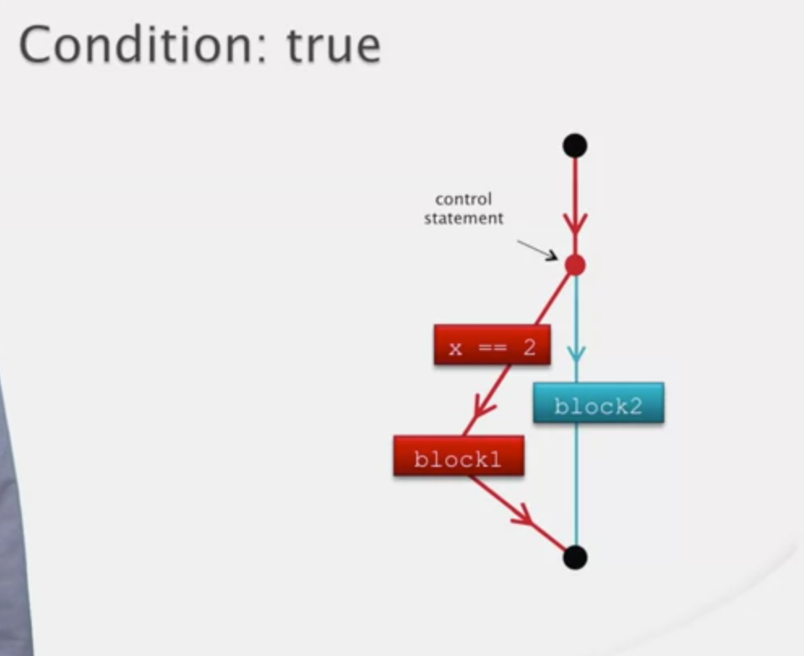
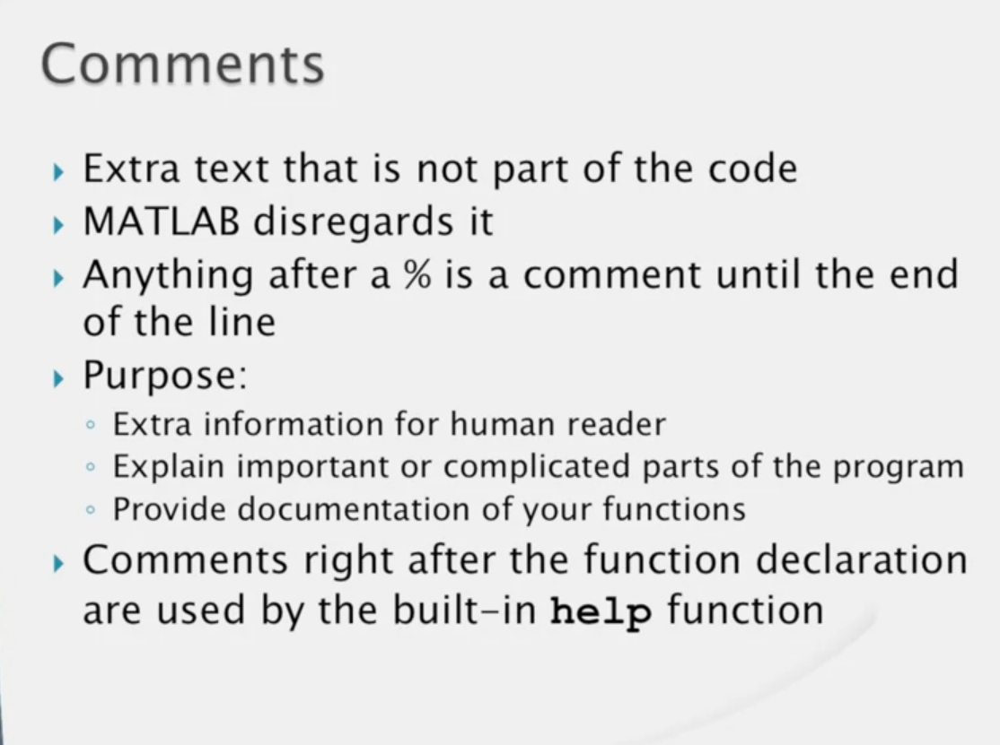

## Module 5

### Introduction to Programmer's Toolbox

- polymorphism


### Matrix Building

```MATLAB
>>zeros(5,6)
>>ones(4,2)
>>5 + ones(4,2)
>>zeros(4)
>>diag([7 3 9 1])
>>rand
>>rand(3,4)
>>rand(5)
>>1 + rand(5,4) * 10
>>fix(1 + rand(5,4) * 10)
>>randi(10,5,4)
>>randi(20, 5)
>>randi([5 10],2, 3)
>>randn(5)
>>r = randn(1, 1000000);
>>hist(r,100)
```


```MATLAB
>>rng(0);
>>rand(1,3)
>>rng(1)
>>[rand, randnm, randi(10)]
>>rng('shuffle');[rand, randnm, randi(10)]
```

### Input / Output

```MATLAB
>>edit one_more
```

```MATLAB
function a = one_more
x = input('Gimme a number, buddy: ');
a = x + 1;
```

```MATLAB
>>fprintf('This concludes lesson 3\n')
```

```MATLAB
function check_out(n, price)
    total = n * price;
    fprintf('%d items at %.2f each\nTotal = $%5.2f\n',n,price,total);
end
```

`\` and `%` are called escape character.

```MATLAB

fprintf('12.5%% of 1234 equals %.3f\n', 0.125*1234)
fprintf('This is a backslash character: \\\n')
fprintf('How about a single quote ('')?\n')
```

```MATLAB

fprintf('%d lb butter, %d tbsp cocoa, %d cps flour, and %d cps sugar\n', 1, 8, 4, 4)
```

If we miss a value in `fprintf` less the the `%` sign it will print till the `%` sign

If we have extra value than the `%` sign it will repeat from the beginning like circular.

```MATLAB
>>fprintf('%4.1f\n', [1 2 3 4 5 6]);
```

### Plotting

```MATLAB
>>a= [1:10].^2
>>plot(a)
>>figure(2);
>>a= [-10:10].^2
>>plot(a)
>>t=-10:10
>>b=t.^2
>>figure
>>plot(t,b);
```

```MATLAB
>>x1 = 0:0.1:2*pi; y1=sin(x1);
>>x2 = pi/2:0.1:3*pi; y2=cos(x2);
>>plot(x1,y1,x2,y2)
>>figure
>>plot(x1,y1,'r',x2,y2,'k:')
```

```MATLAB
>>figure(1)
>>plot(t,b,'m--o')
```

```MATLAB
>>figure(2)
>>plot(x1, y1,'r')
>>hold on
>>plot(x2, y2,'k:')
>>hold off
>>plot(x1,y1,'g*')
>>figure(3)
>>grid
>>title('A sine Plot and a cosine Plot');
>>xlabel('The argument of sine and cosine')
>>ylabel('The value for sine or cosine')
>>legend('sine','cosine')
>>axis([-2 12 -1.5 1.5])\
>>close(4)
>>close all
```

### Debugging


## Module 6

### Selection


```MATLAB
function guess_my_number(x)
    if x == 2
        fprintf('Congrats! You guessed my number!\n');
    end
end
```





```MATLAB
function guess_my_number(x)
    if x == 2
        fprintf('Congrats! You guessed my number!\n');
    else
        fprintf('Not right, but a good guess.\n');
    end
end
```

```MATLAB
function guess_my_number(x)
    if x == 42
        fprintf('Congrats! You guessed my number!\n');
    elseif x < 42
        fprintf('Too small. Try again\n');
    else
        fprintf('Too big. Try again.\n');
    end
end
```

```MATLAB
function day_of_week(n)
    if n == 1
        fprintf('Sunday,');
        day_type=2;
    elseif n == 2
        fprintf('Monday,');
        day_type=1;
    elseif n == 3
        fprintf('Tuesday,');
        day_type=1;
    elseif n == 4
        fprintf('Wednesday,');
        day_type=1;
    elseif n == 5
        fprintf('Thursday,');
        day_type=1;
    elseif n == 6
        fprintf('Friday,');
        day_type=1;
    elseif n == 7
        fprintf('Saturday,');
        day_type=2;
    else
        fprintf('Number must be from 1 to 7.\n');
        return
    end

    if day_type == 1
        fprintf(' which is a week day\n');
    else
        fprintf(' which is a weekend day\n');
    end
end
```


### Relational and Logical Operators


```MATLAB
>> 10 == 20
>> 3 == (35-32)
>> x = (16 * 64 > 1000) + 9
>> x = 16 * 64 > 1000 + 9
```

```MATLAB
function if_test(x)
    if x
        fprintf('%d is true!\n', x);
    else
        fprintf('%d is false!\n',x);
    end
end
```

```MATLAB
>> [4 -1 7 5 3] .* [5 -9 6 5 -3]
>> [4 -1 7 5 3] > [5 -9 6 5 -3]
>> [4 -1 7 5 3] <= 4
>> sum([14 9 3 14 8 3] == 14)
```


```MATLAB
function a = order3(x,y,z)
    if x <=y && y <= z
        a = 1;
    elseif x >= y && y >= z
        a = -1;
    else
        a = 0;
    end
end
```

```MATLAB
function a = not_smallest(x,y,z)
    if x >= y || x >= z
        a = 1;
    else
        a= 0;
    end
end
```

```MATLAB
>> 1 && 2
>> pi && -1234
>> 0 && 1
>> 23 && 0
>> 0 & 0
>> 1 || 2
>> pi || -1234
>> 0 || 1
>> 23 || 0
>> 0 || 0

>> a = 1
>> b = 2
>> c = 0
>> d = ~(a && b) || (b && c)
>> d = ~(a && b) || (b || c)

>> b * (0<b && b<10)

>> total = 0
>> b = 5;
>> total = total + b * (0 < b && b < 10)
>> b = 3;
>> total = total + b * (0 < b && b < 10)
>> b = 11;
>> total = total + b * (0 < b && b < 10)

>> [1 pi 0 -2]
>> ~[1 pi 0 -2]

>> [1 -3 0 9 0] && [pi 0 0 2 3]  % gives error

>> [1 -3 0 9 0] & [pi 0 0 2 3]

>> [1 -3 0 9 0] | [pi 0 0 2 3]

>> 2 & [0 1; 2 3]
>> 2 | [0 1; 2 3]

>> 1.4 < sqrt(2) & [pi >3 -1 > 1 ]

>> (1.4 < sqrt(2)) & [pi >3 -1 > 1 ]

>> 1.4 < (sqrt(2) & [pi >3 -1 > 1 ])
```


### Nested If-Statements


### Variable Number of Function Arguments


```MATLAB
function [table, summa] = multable(n, m)
    if nargin < 2
        m = n;
    end
    
    table = (1:n)' * (1:m);
    
    if nargout ==2
        summa = sum(table(:));
    end
end
```

### Robustness





```MATLAB
function [table, summa] = multable(n, m)

%MULTABLE multiplication table.
% T = MULTABLE(N) returns an N-by-N matrix
% containing the multiplication table for
% the integers 1 through N.
% MULTABLE(N,M) returns an N-by-M matrix.
% Both input arguments must be positive
% integers.
% [T SM] = MULTABLE(...) returns the matrix
% containing the multiplication table in T
% and the sum of all its elements in SM.

    if nargin < 1
        error('must have at least one input argument');
    end
    if nargin < 2
        m = n;
    elseif ~isscalar(m) || m < 1 || m ~= fix(m)
        error('m needs to be a positive integer');
    end
 
    if ~isscalar(n) || n < 1 || n ~= fix(n)
        error('n needs to be a positive integer');
    end
    
    table = (1:n)' * (1:m);
    
    if nargout ==2
        summa = sum(table(:));
    end
end
```
