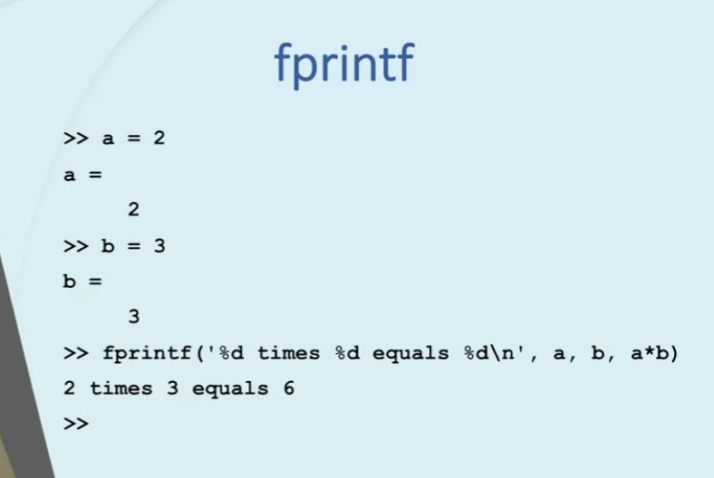
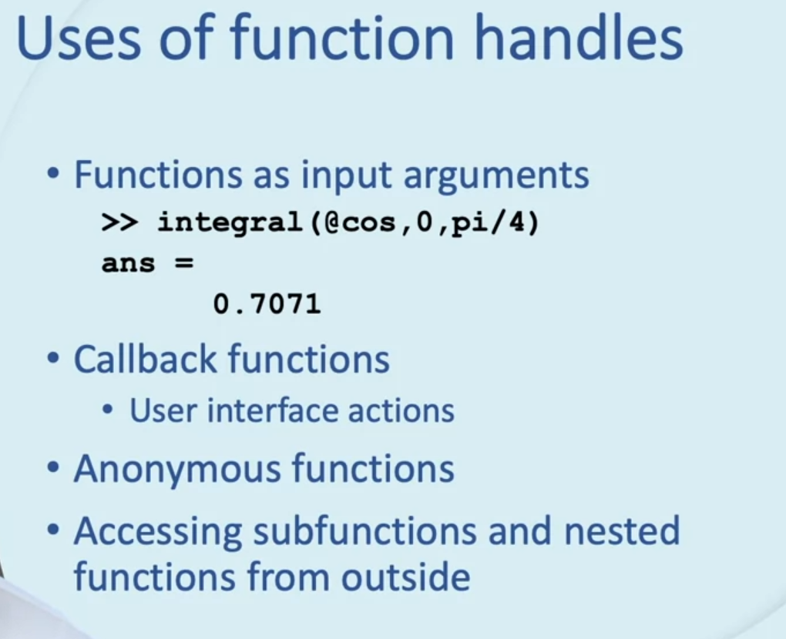
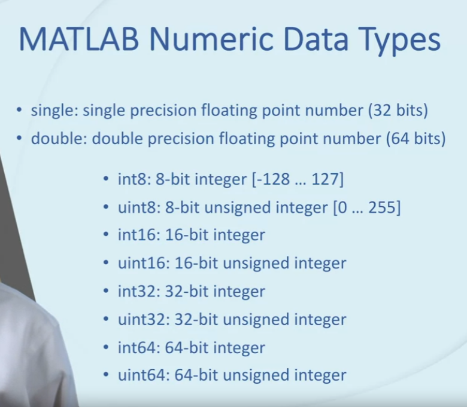
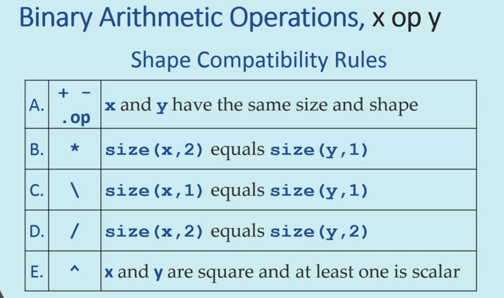
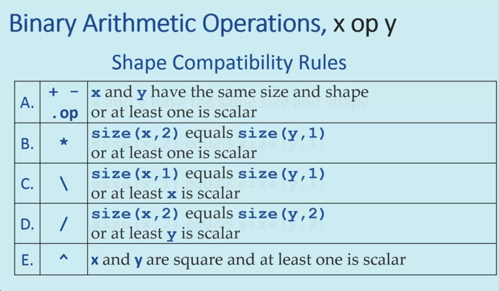
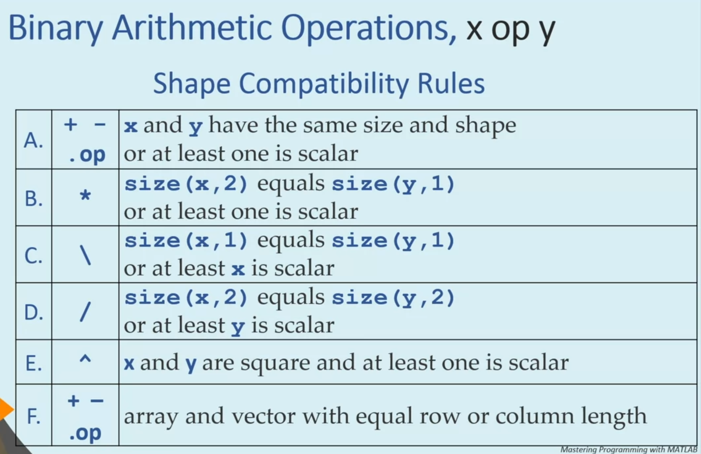
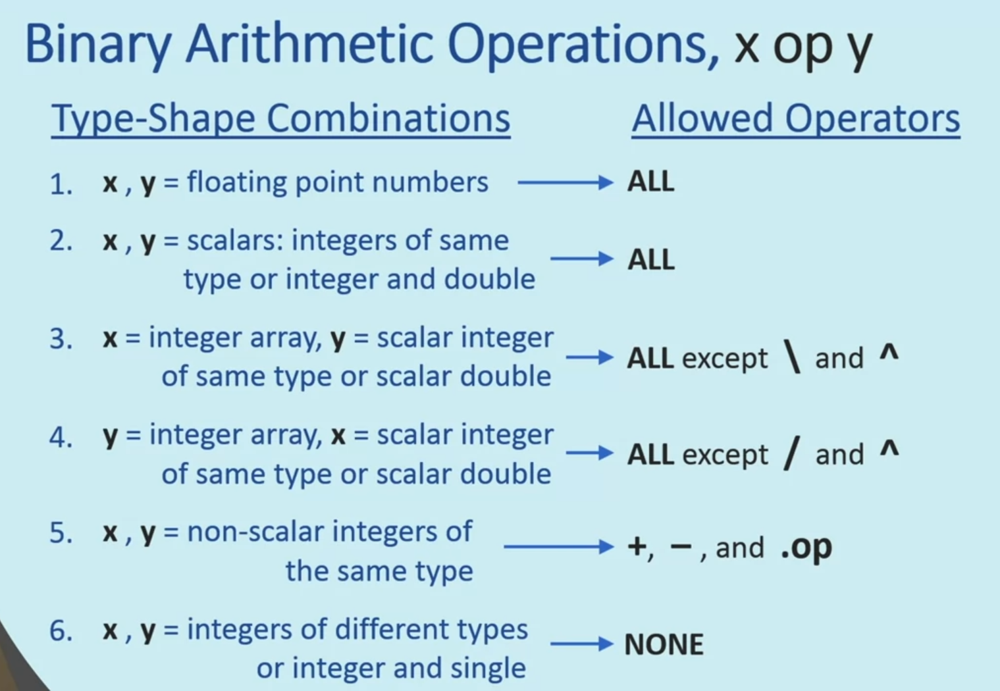
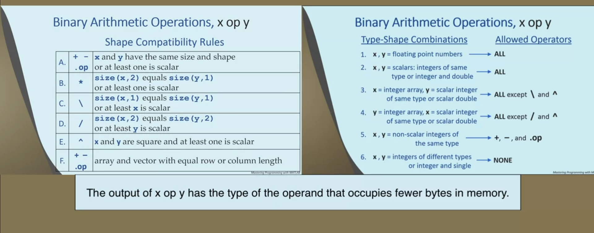

## Module 2

### Variable Number of Arguments



```MATLAB
function index = find_first(v,e)
    if nargin == 0
        error('At least one argument is required')
    elseif nargin == 1
        e = 0;
    end
    index = 0;
    indices = find(v == e);
    if ~isempty(indices)
        index = indices(1);
    end
end
```
```MATLAB
>> rng(0); w = randi([-3, 3], 1, 12)
>> find_first(w,1)
>> find_first(w,2)
>> find_first(w,12)
>> find_first(w,0)
>> find_first(w)
```

```MATLAB
function print_all(varargin)
    for ii = 1:nargin
        fprintf('Here is input argument number %d: %d\n', ii, varargin{ii})
    end
end
```

```MATLAB
>> print_all(pi)
>> print_all(7, -3)
>> print_all(8, 0, 4, 18234, 5.67)
>> sprintf('the first three positive integers are %d, %d, and %d',1,2,3)
```

```MATLAB
function out = print_num(format,varargin)
    out = '';
    argindex = 1;
    skip = false;
    for ii = 1:length(format)
        if skip
            skip = false;
        else
            if format(ii) ~= '%'
                out(end+1) = format(ii);
            else
                if ii+1 > length(format)
                    break;
                end
                if format(ii+1) == '%'
                    out(end+1) = '%';
                else
                    if argindex >= nargin
                        error('not enough input arguments');
                    end
                    out = [out num2str(varargin{argindex},format(ii:ii+1))];
                    argindex = argindex + 1;
                end
                skip = true;
            end
        end
    end
end
```

```MATLAB
>> print_num('the first three positive integers are %d, %d, and %d',1,2,3)
>> pct = 20; a = 934.4; print_num('%d%% of %f is %f', pct, a, a*pct/100)
>> print_num('let us make an error: %d', 1, 2)
>> print_num('let us make another error: %d and %f', 1) % gives error
```

```MATLAB
function varargout = distribute(v)
    for ii = 1:length(v)
        varargout{ii} = v(ii);
    end
end
```

```MATLAB
>> [a, b, c] = distribute([14, -pi, 0])
>> [a, b] = distribute([14, -pi, 0])
>> [a, b, c, d] = distribute([14, 15, 16]) % gives error
```

#### Problem 1: Name-value Pairs

Name-value pairs are frequently used in programming. For our purposes here, a name-value pair consists of a name (a char vector) and a value that can be of any data type. Write a function called name_value_pairs that has a variable number of input arguments representing name-value pairs. Naturally, they come in pairs: the first is the name, the next is the value. This means that the function must be called with an even number of actual input arguments. The function returns a single cell array which has exactly two columns: the first column contains the names, while the second column contains the values. If the function is called with no input arguments, or it is called with an odd number of inputs or if a name is not of char type, the function returns an empty cell array. Here is an example run:


```MATLAB
>> db = name_value_pairs('name','John Smith','age',32,'children',{'Joe' 'Jill'})
db =
  3x2 cell array
    {'name'    }    {'John Smith'}
    {'age'     }    {[        32]}
    {'children'}    {1x2 cell    }
```

```MATLAB
function db = name_value_pairs(varargin)
    if nargin == 0 || rem(nargin, 2) == 1
        db = {};
        return
    end
    jj = 1;
    for ii = 1:2:nargin
        if ischar(varargin{ii})
            db{jj,1} = varargin{ii};
            db{jj,2} = varargin{ii + 1};
            jj = jj + 1;
        else
            db = {};
            break;
        end
    end
end
```

```MATLAB
function store = sol_name_value_pairs(varargin)
    % Initialize an empty cell array
    store = {};
    % If the input does not come in pairs (remainder = 1), return
    if rem(length(varargin),2)
        return;
    end
    
    for ii = 1:floor(length(varargin)/2)
        % The Name part must be a char. If not, return an empty cell
        if ~ischar(varargin{2*ii-1})
            store = {};
            return;
        end
        store{ii,1} = varargin{2*ii-1};
        store{ii,2} = varargin{2*ii};
    end
end
```

#### Problem 2: Data Entry

In a voting center, the voters are required to give their names and ID numbers to the voting staff before going into the voting room. Write a function called voters to record the incoming voters' information. The function should take an unspecified number of inputs, but the first input will be the current database. The rest of the arguments must come in the order of name, a string or char array, and ID, an integer or integer-valued double. If there is at least one ocurrence of no ID number after a name, or the data types are not what's required, return the original database. The function should return a struct array containing Name (a string) and ID (a double) fields as shown below.

```MATLAB
>> database = voters([], 'Brandon', 12356)
database = 
  struct with fields:
    Name: "Brandon"
      ID: 12356

>> database = voters(database, "Mike", 9876, 'Akos', 112233)
database = 
  1x3 struct array with fields:
    Name
    ID

>> database(end)
ans = 
  struct with fields:
    Name: "Akos"
      ID: 112233
```

However, if there is an illegal call, the database should not change:

```MATLAB
>> database
database = 
  1x3 struct array with fields:
    Name
    ID

>> database = voters(database, 'Student', 99999, "No ID")
database = 
  1x3 struct array with fields:
    Name
    ID
```

```MATLAB
function db = voters(database, varargin)
    if isempty(database)
        db = struct('Name', {}, 'ID', {});
    end
    if rem(length(varargin),2) == 1
        db = database;
        return;
    end
    arguments_length = length(varargin)/2;
    for ii = 1:arguments_length
        jj = 2 * ii;
        if (ischar(varargin{jj-1}) || isstring(varargin{jj-1})) && isa(varargin{jj},'double') && (fix(varargin{jj})==(varargin{jj}))
            db(ii).Name = string(varargin{jj-1});
            db(ii).ID = double(varargin{jj});
        else
            db = database;
            return;
        end
    end
    db = [database db];
end
```

```MATLAB
function database = sol_voters(database,varargin)
    % Get the length of the input database
    count = length(database);
    
    % Create a copy of the database. This will be the new database if input
    % is valid
    tmp = database;
    
    % Names and IDs come in pairs. Increment loop counter by 2
    for ii = 1:2:length(varargin)
        % Make sure the Name is a char or string
        if ischar(varargin{ii}) || isstring(varargin{ii})
            count = count + 1;
            tmp(count).Name = string(varargin{ii});
            % Make sure there is a valid ID
            if ii+1 <= length(varargin) && isnumeric(varargin{ii+1}) && round(varargin{ii+1}) == varargin{ii+1}
                tmp(count).ID = varargin{ii+1};
            else
                % Not valid input. Return original database
                return;
            end
        else
            % Not valid input. Return orginal database
            return;
        end
    end
    % All inputs valid. Update database.
    database = tmp;
end
```

### Function Handles and Nested Functions



```MATLAB
>> trig = @sin
>> x = trig(pi/2)
>> plot(trig(0:0.01:2*pi));
>> close all
>> x = trig
>> x(pi/2)
>> x = pi
>> mypi = @pi
>> x = mypi
>> y = mypi()
>> xpt = [@sin @cos @plot] % gives error
>> xpt = {@sin @cos @plot}
>> xpt{2}(0)
>> xpt{3}(xpt{1}(-pi:0.01:pi))
```

```MATLAB
>> fplot(@sin,[0 2*pi])
>> plot(0:0.01:2*pi,sin(0:0.01:2*pi))
>> fplot(@tan, [0, pi])
>> fplot(@tan,[0,pi],"MeshDensity",30)
>> plot(0:0.01:pi, tan(0:0.01:pi))
>> plot(0:0.001:pi, tan(0:0.001:pi))
>> close; clear;clc
```

```MATLAB
>> poly = @(x) 2*x.^3-x.^2+2*x - 12 % anonymous function
>> poly(1)
>> poly(0:5)
>> plot(-10:10, poly(-10:10))
>> fplot(poly,[-10,10])
>> close
>> xfn = @(x,y) x+y;
>> xfn(1,2)
>> x= 1000; y= 2000;
>> xfn(10,12)
>> x, y
>> c = 10;
>> f = @(x) c*x
>> f(3)
>> c = 11;
>> f(3)
>> clear c
>> f(3)
>> clear; clc
```

```MATLAB
>> trig = @sin
>> fplot(@(x) x + sin(x), [-5,5])
>> clear; close; clc
>> smax = @(A) max(A.^2)
>> [mx ind] = smax([1 2; 3 4])
>> smax(1:10)
>> xyz = @(x,y) deal(x*y, x+y)
>> [p, s] = xyz(10, 20)
>> clear; clc
>> 
```
**Nested Function**
```MATLAB
function [y1, y2] = first_nested_example(x)
    c = 10;
    sub(c,x);
    y1 = inner(x);
    
    function out = inner(in)
        out = c*in;
    end
    
    c = 11;
    sub(c,x)
    y2 = inner(x);
end
 
function sub(in1,in2)
    fprintf('Multiplying %d times %d\n',in1,in2)
end
```

```MATLAB
>> [a1 b1] = first_nested_example(3)
```

```MATLAB
function circle_area = assignment_rule(r)
 
    calculate_area
    fprintf('Area of circle with radius %.1f = %.1f\n',r,circle_area)
    
    function calculate_area
        circle_area = pi*r^2;
    end  
end
```

All input and output arguments of a function are accessible to the nested function

```MATLAB
>> assignment_rule(4)
```
Nested Nested Function

```MATLAB
function A
    xA = 1;
    function B
        xB = 2;
        function C
            xC = 3;
            show('C','xA',xA)
            show('C','xB',xB)
            show('C','xC',xC)
        end % C
        show('B','xA',xA)
        show('B','xB',xB);
        C
        D
    end % B
    function D
        xD = 4;
        show('D','xA',xA);
        show('D','xD',xD);
    end % D
    show('A','xA',xA)
    B
    D
end % A
function show(funct,name,value)
    fprintf('in %s: %s = %d\n',funct,name,value);
end
```

```MATLAB
>> A
>> 
```
sibling function can call each other but can't share variable


```MATLAB
>> c = 10;
>> f = @(x)  c*x
>> f(3)
>> c = 11;
>> f(3)
>> clear c
>> f(3)
```

```MATLAB
function fh = get_anon_handle(c)
    
    fh = @(x) c*x;
    
end
```

```MATLAB
>> f10 = get_anon_handle(10)
>> f11 = get_anon_handle(11)
>> f10(3)
>> f11(3)
```

Function that returns a nested function

```MATLAB
function fh = get_polynomial_handle(p)
 
    function polynomial = poly(x)
        polynomial = 0;
        for ii = 1:length(p)
            polynomial = polynomial + p(ii).*x.^(ii-1);
        end
    end
    
    fh = @poly;
end
```

```MATLAB
>> pc = get_polynomial_handle([-4, -1, 3, 1])
>> pc(1)
>> pq = get_polynomial_handle([-1, 0, 7])
>> pq(1)
>> pc(1)
>> fplot(pc,[-3,2]); hold on; fplot(pq,[-3,2])
```

ancestor and descendant can share variable(nonlocal scope)

**Nesting function** was first defined in `ALGOL`

#### Problem 1: Autograder

Here is you chance to write an autograder! Specifically, write a function called grader that tests two functions (one is supposed to be the student's solution and the other the
reference solution provided by the instructor) by calling them repeatedly with various input arguments and comparing the results. For simplicity, we assume that both functions 
take exactly one input argument. The inputs to the grader function are two function handles followed by a variable number of additional input arguments. The function must call the 
two functions with each of the supplied input agruments one by one. If the results match for all test cases, that is, for each input argument, the grader function returns logical true.
Otherwise, it returns false. Note that in order to ensure that the comparison works for arrays and not just scalars, you should use the isequal function as opposed to the == operator.
Here are a few sample runs using built-in functions:

```MATLAB
>> grader(@sin,@max,0)
ans =
  logical
   1
>> grader(@sin,@max,0,1)
ans =
  logical
   0
>> grader(@cos,@cos,-pi,0,pi,[0:0.1:1])
ans =
  logical
   1
```

```MATLAB
function output = grader(f1,f2,varargin)
    for ii = 1:length(varargin)
        if ~isequal(f1(varargin{ii}),f2(varargin{ii}))
            output = false;
            return
        end
    end
    output = true;
end
```

```MATLAB
function pass = sol_grader(fn1,fn2,varargin)
    pass = false;
    for ii = 1:length(varargin)
        if ~isequal(fn1(varargin{ii}),fn2(varargin{ii}))
            return;
        end
    end
    pass = true;
end
```

#### Problem 2: Fun with Polynomials

Remember the example from the video that showed how to return a function handle to a nested function that computed the value of a polynomial? Here it is:

```MATLAB
function fh = get_polynomial_handle(p)
    function polynomial = poly(x)
        polynomial = 0;
        for ii = 1:length(p)
            polynomial = polynomial + p(ii) .* x.^(ii-1);
        end
    end    
    fh = @poly;
end
```
It takes a vector of coefficients p, defines a function that returns the value of the polynomial given the scalar input x, and returns a function handle to it. Here is an example run:

```MATLAB
>> p = get_polynomial_handle(1:5)
p =
  function_handle with value:
    @get_polynomial_handle/poly
>> p(1)
ans =
    15
```
Your task is simple: modify the code above so that it does not use any loops.

```MATLAB
function fh = poly_fun(p)
    function polynomial = poly(x)
        polynomial = sum(p .* x.^(0:length(p)-1));
    end    
    fh = @poly;
end
```

```MATLAB
function fh = poly_fun(p)
    function polynomial = poly(x)
        polynomial = sum(p .* x.^(0 : length(p)-1));
    end 
    fh = @poly;
end
```
## Module 3

### Mixed Mode Arithmetic



```MATLAB
>> 4 * pi
>> int8(200) + int8(300) % retuns 127
>> -3
>> 
```



```MATLAB
>> [1 2 3; 3 4 5] * [6;7;8]
>> [6;7;8] * [1 2 3; 3 4 5] % gives error
>> [1 2 3; 4 5 6; 7 8 9] ^ 11
>> [1 2 3; 4 5 6] ^ 11 % gives error
>> 
```





- Rules `B` through `E` only work with two dimensional arrays
- Rule `A` and `F` work for any number of dimension




- Can't raise integer to fractional power

- the type of output of an operation is that which takes least space and time
```MATLAB
>> n = int16(9876)
>> x = 12
>> x + n
>> n*x, n/x, n^x
>> x/n
>> x/9876
>> clear; clc
>> M = imread('matlab.png');
>> imshow(M)
>> whos
>> D = M/3;
>> imshow(D)
>> D = double(M)/3; % this operation is called widening
>> whos
>> D = M/uint8(3); % Narrowing
>> whos
>> clear; clc
>> a = int8(17)
>> b = double(a)/2
>> c = double(a/2)
>> f = int8(2)
>> b = double(a)/f
>> c = double(a/f)
```



