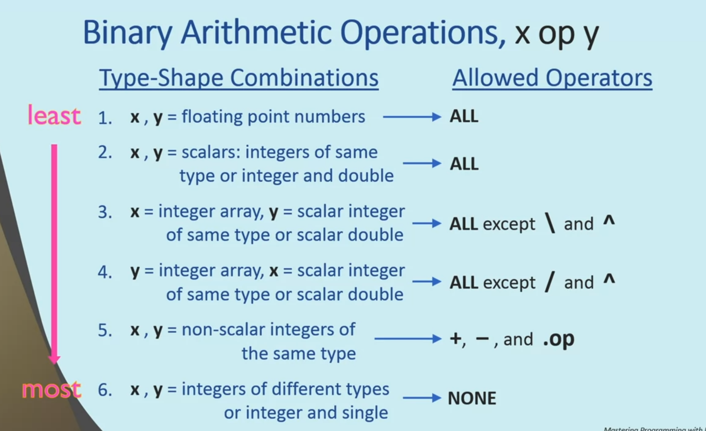
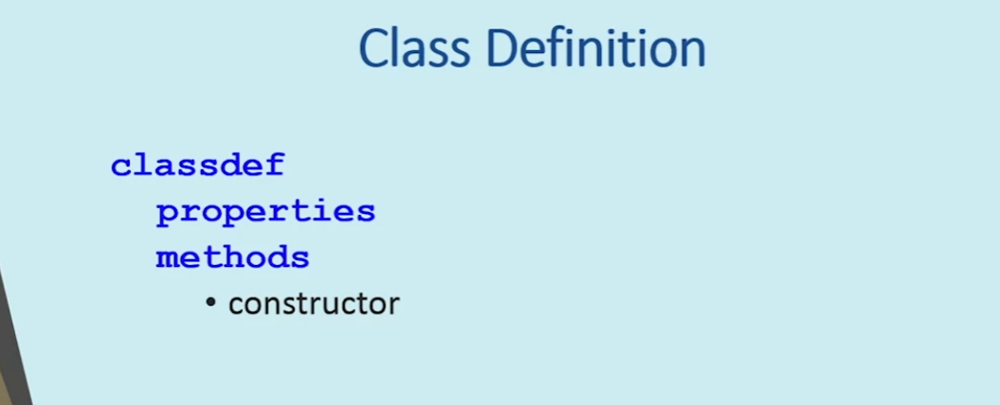

## Module 2

### Variable Number of Arguments


```MATLAB
function index = find_first(v,e)
    if nargin == 0
        error('At least one argument is required')
    elseif nargin == 1
        e = 0;
    end
    index = 0;
    indices = find(v == e);
    if ~isempty(indices)
        index = indices(1);
    end
end
```
```MATLAB
>> rng(0); w = randi([-3, 3], 1, 12)
>> find_first(w,1)
>> find_first(w,2)
>> find_first(w,12)
>> find_first(w,0)
>> find_first(w)
```

```MATLAB
function print_all(varargin)
    for ii = 1:nargin
        fprintf('Here is input argument number %d: %d\n', ii, varargin{ii})
    end
end
```

```MATLAB
>> print_all(pi)
>> print_all(7, -3)
>> print_all(8, 0, 4, 18234, 5.67)
>> sprintf('the first three positive integers are %d, %d, and %d',1,2,3)
```

```MATLAB
function out = print_num(format,varargin)
    out = '';
    argindex = 1;
    skip = false;
    for ii = 1:length(format)
        if skip
            skip = false;
        else
            if format(ii) ~= '%'
                out(end+1) = format(ii);
            else
                if ii+1 > length(format)
                    break;
                end
                if format(ii+1) == '%'
                    out(end+1) = '%';
                else
                    if argindex >= nargin
                        error('not enough input arguments');
                    end
                    out = [out num2str(varargin{argindex},format(ii:ii+1))];
                    argindex = argindex + 1;
                end
                skip = true;
            end
        end
    end
end
```

```MATLAB
>> print_num('the first three positive integers are %d, %d, and %d',1,2,3)
>> pct = 20; a = 934.4; print_num('%d%% of %f is %f', pct, a, a*pct/100)
>> print_num('let us make an error: %d', 1, 2)
>> print_num('let us make another error: %d and %f', 1) % gives error
```

```MATLAB
function varargout = distribute(v)
    for ii = 1:length(v)
        varargout{ii} = v(ii);
    end
end
```

```MATLAB
>> [a, b, c] = distribute([14, -pi, 0])
>> [a, b] = distribute([14, -pi, 0])
>> [a, b, c, d] = distribute([14, 15, 16]) % gives error
```

#### Problem 1: Name-value Pairs

Name-value pairs are frequently used in programming. For our purposes here, a name-value pair consists of a name (a char vector) and a value that can be of any data type. Write a function called name_value_pairs that has a variable number of input arguments representing name-value pairs. Naturally, they come in pairs: the first is the name, the next is the value. This means that the function must be called with an even number of actual input arguments. The function returns a single cell array which has exactly two columns: the first column contains the names, while the second column contains the values. If the function is called with no input arguments, or it is called with an odd number of inputs or if a name is not of char type, the function returns an empty cell array. Here is an example run:


```MATLAB
>> db = name_value_pairs('name','John Smith','age',32,'children',{'Joe' 'Jill'})
db =
  3x2 cell array
    {'name'    }    {'John Smith'}
    {'age'     }    {[        32]}
    {'children'}    {1x2 cell    }
```

```MATLAB
function db = name_value_pairs(varargin)
    if nargin == 0 || rem(nargin, 2) == 1
        db = {};
        return
    end
    jj = 1;
    for ii = 1:2:nargin
        if ischar(varargin{ii})
            db{jj,1} = varargin{ii};
            db{jj,2} = varargin{ii + 1};
            jj = jj + 1;
        else
            db = {};
            break;
        end
    end
end
```

```MATLAB
function store = sol_name_value_pairs(varargin)
    % Initialize an empty cell array
    store = {};
    % If the input does not come in pairs (remainder = 1), return
    if rem(length(varargin),2)
        return;
    end
    
    for ii = 1:floor(length(varargin)/2)
        % The Name part must be a char. If not, return an empty cell
        if ~ischar(varargin{2*ii-1})
            store = {};
            return;
        end
        store{ii,1} = varargin{2*ii-1};
        store{ii,2} = varargin{2*ii};
    end
end
```

#### Problem 2: Data Entry

In a voting center, the voters are required to give their names and ID numbers to the voting staff before going into the voting room. Write a function called voters to record the incoming voters' information. The function should take an unspecified number of inputs, but the first input will be the current database. The rest of the arguments must come in the order of name, a string or char array, and ID, an integer or integer-valued double. If there is at least one ocurrence of no ID number after a name, or the data types are not what's required, return the original database. The function should return a struct array containing Name (a string) and ID (a double) fields as shown below.

```MATLAB
>> database = voters([], 'Brandon', 12356)
database = 
  struct with fields:
    Name: "Brandon"
      ID: 12356

>> database = voters(database, "Mike", 9876, 'Akos', 112233)
database = 
  1x3 struct array with fields:
    Name
    ID

>> database(end)
ans = 
  struct with fields:
    Name: "Akos"
      ID: 112233
```

However, if there is an illegal call, the database should not change:

```MATLAB
>> database
database = 
  1x3 struct array with fields:
    Name
    ID

>> database = voters(database, 'Student', 99999, "No ID")
database = 
  1x3 struct array with fields:
    Name
    ID
```

```MATLAB
function db = voters(database, varargin)
    if isempty(database)
        db = struct('Name', {}, 'ID', {});
    end
    if rem(length(varargin),2) == 1
        db = database;
        return;
    end
    arguments_length = length(varargin)/2;
    for ii = 1:arguments_length
        jj = 2 * ii;
        if (ischar(varargin{jj-1}) || isstring(varargin{jj-1})) && isa(varargin{jj},'double') && (fix(varargin{jj})==(varargin{jj}))
            db(ii).Name = string(varargin{jj-1});
            db(ii).ID = double(varargin{jj});
        else
            db = database;
            return;
        end
    end
    db = [database db];
end
```

```MATLAB
function database = sol_voters(database,varargin)
    % Get the length of the input database
    count = length(database);
    
    % Create a copy of the database. This will be the new database if input
    % is valid
    tmp = database;
    
    % Names and IDs come in pairs. Increment loop counter by 2
    for ii = 1:2:length(varargin)
        % Make sure the Name is a char or string
        if ischar(varargin{ii}) || isstring(varargin{ii})
            count = count + 1;
            tmp(count).Name = string(varargin{ii});
            % Make sure there is a valid ID
            if ii+1 <= length(varargin) && isnumeric(varargin{ii+1}) && round(varargin{ii+1}) == varargin{ii+1}
                tmp(count).ID = varargin{ii+1};
            else
                % Not valid input. Return original database
                return;
            end
        else
            % Not valid input. Return orginal database
            return;
        end
    end
    % All inputs valid. Update database.
    database = tmp;
end
```

### Function Handles and Nested Functions


```MATLAB
>> trig = @sin
>> x = trig(pi/2)
>> plot(trig(0:0.01:2*pi));
>> close all
>> x = trig
>> x(pi/2)
>> x = pi
>> mypi = @pi
>> x = mypi
>> y = mypi()
>> xpt = [@sin @cos @plot] % gives error
>> xpt = {@sin @cos @plot}
>> xpt{2}(0)
>> xpt{3}(xpt{1}(-pi:0.01:pi))
```

```MATLAB
>> fplot(@sin,[0 2*pi])
>> plot(0:0.01:2*pi,sin(0:0.01:2*pi))
>> fplot(@tan, [0, pi])
>> fplot(@tan,[0,pi],"MeshDensity",30)
>> plot(0:0.01:pi, tan(0:0.01:pi))
>> plot(0:0.001:pi, tan(0:0.001:pi))
>> close; clear;clc
```

```MATLAB
>> poly = @(x) 2*x.^3-x.^2+2*x - 12 % anonymous function
>> poly(1)
>> poly(0:5)
>> plot(-10:10, poly(-10:10))
>> fplot(poly,[-10,10])
>> close
>> xfn = @(x,y) x+y;
>> xfn(1,2)
>> x= 1000; y= 2000;
>> xfn(10,12)
>> x, y
>> c = 10;
>> f = @(x) c*x
>> f(3)
>> c = 11;
>> f(3)
>> clear c
>> f(3)
>> clear; clc
```

```MATLAB
>> trig = @sin
>> fplot(@(x) x + sin(x), [-5,5])
>> clear; close; clc
>> smax = @(A) max(A.^2)
>> [mx ind] = smax([1 2; 3 4])
>> smax(1:10)
>> xyz = @(x,y) deal(x*y, x+y)
>> [p, s] = xyz(10, 20)
>> clear; clc
>> 
```
**Nested Function**
```MATLAB
function [y1, y2] = first_nested_example(x)
    c = 10;
    sub(c,x);
    y1 = inner(x);
    
    function out = inner(in)
        out = c*in;
    end
    
    c = 11;
    sub(c,x)
    y2 = inner(x);
end
 
function sub(in1,in2)
    fprintf('Multiplying %d times %d\n',in1,in2)
end
```

```MATLAB
>> [a1 b1] = first_nested_example(3)
```

```MATLAB
function circle_area = assignment_rule(r)
 
    calculate_area
    fprintf('Area of circle with radius %.1f = %.1f\n',r,circle_area)
    
    function calculate_area
        circle_area = pi*r^2;
    end  
end
```

All input and output arguments of a function are accessible to the nested function

```MATLAB
>> assignment_rule(4)
```
Nested Nested Function

```MATLAB
function A
    xA = 1;
    function B
        xB = 2;
        function C
            xC = 3;
            show('C','xA',xA)
            show('C','xB',xB)
            show('C','xC',xC)
        end % C
        show('B','xA',xA)
        show('B','xB',xB);
        C
        D
    end % B
    function D
        xD = 4;
        show('D','xA',xA);
        show('D','xD',xD);
    end % D
    show('A','xA',xA)
    B
    D
end % A
function show(funct,name,value)
    fprintf('in %s: %s = %d\n',funct,name,value);
end
```

```MATLAB
>> A
>> 
```
sibling function can call each other but can't share variable


```MATLAB
>> c = 10;
>> f = @(x)  c*x
>> f(3)
>> c = 11;
>> f(3)
>> clear c
>> f(3)
```

```MATLAB
function fh = get_anon_handle(c)
    
    fh = @(x) c*x;
    
end
```

```MATLAB
>> f10 = get_anon_handle(10)
>> f11 = get_anon_handle(11)
>> f10(3)
>> f11(3)
```

Function that returns a nested function

```MATLAB
function fh = get_polynomial_handle(p)
 
    function polynomial = poly(x)
        polynomial = 0;
        for ii = 1:length(p)
            polynomial = polynomial + p(ii).*x.^(ii-1);
        end
    end
    
    fh = @poly;
end
```

```MATLAB
>> pc = get_polynomial_handle([-4, -1, 3, 1])
>> pc(1)
>> pq = get_polynomial_handle([-1, 0, 7])
>> pq(1)
>> pc(1)
>> fplot(pc,[-3,2]); hold on; fplot(pq,[-3,2])
```

ancestor and descendant can share variable(nonlocal scope)

**Nesting function** was first defined in `ALGOL`

#### Problem 1: Autograder

Here is you chance to write an autograder! Specifically, write a function called grader that tests two functions (one is supposed to be the student's solution and the other the
reference solution provided by the instructor) by calling them repeatedly with various input arguments and comparing the results. For simplicity, we assume that both functions 
take exactly one input argument. The inputs to the grader function are two function handles followed by a variable number of additional input arguments. The function must call the 
two functions with each of the supplied input agruments one by one. If the results match for all test cases, that is, for each input argument, the grader function returns logical true.
Otherwise, it returns false. Note that in order to ensure that the comparison works for arrays and not just scalars, you should use the isequal function as opposed to the == operator.
Here are a few sample runs using built-in functions:

```MATLAB
>> grader(@sin,@max,0)
ans =
  logical
   1
>> grader(@sin,@max,0,1)
ans =
  logical
   0
>> grader(@cos,@cos,-pi,0,pi,[0:0.1:1])
ans =
  logical
   1
```

```MATLAB
function output = grader(f1,f2,varargin)
    for ii = 1:length(varargin)
        if ~isequal(f1(varargin{ii}),f2(varargin{ii}))
            output = false;
            return
        end
    end
    output = true;
end
```

```MATLAB
function pass = sol_grader(fn1,fn2,varargin)
    pass = false;
    for ii = 1:length(varargin)
        if ~isequal(fn1(varargin{ii}),fn2(varargin{ii}))
            return;
        end
    end
    pass = true;
end
```

#### Problem 2: Fun with Polynomials

Remember the example from the video that showed how to return a function handle to a nested function that computed the value of a polynomial? Here it is:

```MATLAB
function fh = get_polynomial_handle(p)
    function polynomial = poly(x)
        polynomial = 0;
        for ii = 1:length(p)
            polynomial = polynomial + p(ii) .* x.^(ii-1);
        end
    end    
    fh = @poly;
end
```
It takes a vector of coefficients p, defines a function that returns the value of the polynomial given the scalar input x, and returns a function handle to it. Here is an example run:

```MATLAB
>> p = get_polynomial_handle(1:5)
p =
  function_handle with value:
    @get_polynomial_handle/poly
>> p(1)
ans =
    15
```
Your task is simple: modify the code above so that it does not use any loops.

```MATLAB
function fh = poly_fun(p)
    function polynomial = poly(x)
        polynomial = sum(p .* x.^(0:length(p)-1));
    end    
    fh = @poly;
end
```

```MATLAB
function fh = sol_poly_fun(p)
    function polynomial = poly(x)
        polynomial = sum(p .* x.^(0 : length(p)-1));
    end 
    fh = @poly;
end
```
## Module 3

### Mixed Mode Arithmetic


```MATLAB
>> 4 * pi
>> int8(200) + int8(300) % retuns 127
>> -3
>> 
```


```MATLAB
>> [1 2 3; 3 4 5] * [6;7;8]
>> [6;7;8] * [1 2 3; 3 4 5] % gives error
>> [1 2 3; 4 5 6; 7 8 9] ^ 11
>> [1 2 3; 4 5 6] ^ 11 % gives error
>> 
```


- Rules `B` through `E` only work with two dimensional arrays
- Rule `A` and `F` work for any number of dimension




- Can't raise integer to fractional power

- the type of output of an operation is that which takes least space and time
```MATLAB
>> n = int16(9876)
>> x = 12
>> x + n
>> n*x, n/x, n^x
>> x/n
>> x/9876
>> clear; clc
>> M = imread('matlab.png');
>> imshow(M)
>> whos
>> D = M/3; %(Darken the image)
>> imshow(D)
>> D = double(M)/3; % this operation is called widening
>> whos
>> D = M/uint8(3); % Narrowing
>> whos
>> clear; clc
>> a = int8(17)
>> b = double(a)/2
>> c = double(a/2)
>> f = int8(2)
>> b = double(a)/f
>> c = double(a/f)
```


#### Problem 1: Edge Detection

Edge Detection

Automatically detecting edges in images is an important task in image processing. An edge detector takes an input image and generates another image where the edges in the original image are highlighted by gray/white colors while other pixels are black. For each 3x3-pixel subset **A**, of an image, we can calculate the magnitude of the gradient at the center pixel of **A** as a weighted sum of all the values in **A**. One common technique is called the Sobel operator specified as

$M = \sqrt{s^2_x+s^2_y}$

where $s_x$ and $s_y$ can be defined as,

$s_x =\begin{bmatrix}   
            -1 & 0 & 1 \\
            -2 & 0 & 2 \\
            -1 & 0 & 1\end{bmatrix}:A$ and $s_y =\begin{bmatrix}   
                                                        1 & 2 & 1 \\
                                                        0 & 0 & 0 \\
                                                    -1 & -2 & -1\end{bmatrix}:A$

Note that the colon in linear algebra means ***double dot product*** which is different from its use in MATLAB. So the formula above means that each pixel $s_x$ and $s_y$ will be a weighted sum of  the values of the neighboring pixels in the original image using the weights specified in the 3x3 matrices above. For example, $s_x$ specifies that the current pixel and its top and bottom neighbors are not used (weights are zero), while the top right neighbor has a weight of 1 and the top left has weight of -1, etc.  The final output pixel is then the root sum squared $s_x$ and $s_y$.

Create a function called **edgy** that takes an original image input, and produces a processed image. Both the input and the output argument are grayscale images, that is, matrices of uint8 values. 

**Note** that the output has two fewer rows and columns than the input since the pixels in the first and last columns and rows do not have enough neighbors for the required computation.

Here is an example input and output ([click here for the image](https://lcms-files.mathworks.com/content/file/754005eb-371a-445c-8842-83026aa34d6c/CocaCola.png?versionId=QCBjo05K.y_4OF0DYGcBVICG50OorXg2)):

 

```MATLAB
function edge = edgy(figure)
    cc = double(figure);
    sx = [-1 0 1; -2 0 2; -1 0 1];
    sy = [1 2 1; 0 0 0; -1 -2 -1];
    B = cc;
    for ii = 2:(size(B,1)-1)
        for jj = 2:(size(B,2)-1)
            A = cc((ii-1):(ii+1),(jj-1):(jj+1));
                x = sx.*A;
                x = sum(sum(x));
                y = sy.*A;
                y = sum(sum(y));
                pixValue = uint8(sqrt(x.^2 + y.^2));
                B(ii,jj) = pixValue;
        end
    end
    B = uint8(B);
    edge = B(2:end-1,2:end-1);
end
```

```MATLAB
function out = sol_edgy(in)
    % Get the size of the input image
    [r, c] = size(in);
    
    % Create an output array that is two rows and columns smaller
    out = zeros(r-2,c-2);
    
    % Use the size of the new array for looping
    [r, c] = size(out);
    
    % Convert to double for doing calculations
    in = double(in);
    
    % Create the horizontal and vertical edge detector filters
    ex = [-1 0 1; -2 0 2; -1 0 1];
    ey = [1 2 1; 0 0 0; -1 -2 -1];
    for ii = 1:r
        for jj = 1:c
            sx = in(ii:ii+2,jj:jj+2) .* ex;
            sy = in(ii:ii+2,jj:jj+2) .* ey;
            % Calculate the output pixel value
            out(ii,jj) = sqrt(sum(sum(sx(:)))^2 + sum(sum(sy(:)))^2);
        end
    end
    % Convert back to uint8
    out = uint8(out);
end
```

#### Problem 2: Audio Mixer

Consider a multi-track audio recording: a uint16 matrix of N columns where each column represents one track, e.g., the recording of one instrument of a band playing a song. 
The input range is between 0 and 65535, a value that a 16-bit analog digital converter would provide. The task is to write a simple mixing function that takes the tracks and 
generates a weighted sum of them. Specifically, write a function called **mixit** that takes two input arguments. The first is a K-by-N matrix of uint16 values where N is the number 
of tracks and K is the number of samples per track. The second input argument is a vector of N double scalars representing the weights of the tracks. The output of the function is a 
K-element column vector of doubles representing a single-track audio recording obtained by mixing the individual tracks according to the static weights. Note that before any of the 
processing takes place, the audio data must be converted to standard interval of [-1 1]. That is, uint16 0 needs to be mapped to -1, while 65535 becomes +1. The output is 
expected to be in the same range. If any element of the final mixed audio is outside of this range, the output needs to be scaled. Hint: find the maximum of the absolute value of 
the output vector. If it is greater than 1, you need to divide the entire vector with that value.

Here is an example:

```MATLAB
>> A = 2.^(0:16)';
>> A = [A flip(A)] - 1;
>> A = uint16(A)
>> format long

A =
  17x2 uint16 matrix

       0   65535
       1   32767
       3   16383
       7    8191
      15    4095
      31    2047
      63    1023
     127     511
     255     255
     511     127
    1023      63
    2047      31
    4095      15
    8191       7
   16383       3
   32767       1
   65535       0

>> mixit(A,[1 1])
ans =
                   0
  -0.503913879277201
  -0.755847750865052
  -0.881768550557478
  -0.944636678200692
  -0.975886197616301
  -0.991141868512111
  -0.998031526336025
  -1.000000000000000
  -0.998031526336025
  -0.991141868512111
  -0.975886197616301
  -0.944636678200692
  -0.881768550557478
  -0.755847750865052
  -0.503913879277201
                   0

>> mixit(A,[1 0])
ans =
  -1.000000000000000
  -0.999969481956207
  -0.999908445868620
  -0.999786373693446
  -0.999542229343099
  -0.999053940642405
  -0.998077363241016
  -0.996124208438239
  -0.992217898832685
  -0.984405279621576
  -0.968780041199359
  -0.937529564354925
  -0.875028610666056
  -0.750026703288319
  -0.500022888532845
  -0.000015259021897
   1.000000000000000

>> mixit(A,[0 1])
ans =
   1.000000000000000
  -0.000015259021897
  -0.500022888532845
  -0.750026703288319
  -0.875028610666056
  -0.937529564354925
  -0.968780041199359
  -0.984405279621576
  -0.992217898832685
  -0.996124208438239
  -0.998077363241016
  -0.999053940642405
  -0.999542229343099
  -0.999786373693446
  -0.999908445868620
  -0.999969481956207
  -1.000000000000000

>> mixit(A,[.5 .5])
ans =
                   0
  -0.499992370489052
  -0.749965667200732
  -0.874906538490883
  -0.937285420004578
  -0.968291752498665
  -0.983428702220188
  -0.990264744029908
  -0.992217898832685
  -0.990264744029908
  -0.983428702220188
  -0.968291752498665
  -0.937285420004578
  -0.874906538490883
  -0.749965667200732
  -0.499992370489052
                   0
   
```

If you want to have some fun with real music, try this in MATLAB (not the grader, as it will not play sound). Don't forget to [download the music.mat](https://lcms-files.mathworks.com/content/file/c8e87170-26f9-4983-a293-3f6b18204493/music.mat?versionId=SqNANElbFpASMtmuXx9N.rzZvlG4KPYT) file (a very short clip of the band 
[Dodapod](https://www.telefunken-elektroakustik.com/live-from-the-lab-season-4) and hit a key after each music segment!

```MATLAB
load music
fs = 24000;
x1 = mixit(music,ones(1,15));
sound(x1,fs);   % you need to do this in MATLAB not in the grader
pause
x2 = mixit(music,[1 1 1 1 1 1 1 1 1 1 1 0 0 0 0]);
sound(x2,fs);
pause
x3 = mixit(music,~[1 1 1 1 1 1 1 1 1 1 1 0 0 0 0]);
sound(x3,fs);
pause
x4 = mixit(music,~[1 1 0 0 0 0 0 0 0 0 0 1 1 1 1]);
sound(x4,fs);
pause
x5 = mixit(music,[1 1 0 0 0 0 0 0 0 0 0  1 1 1 1]);
sound(x5,fs);

```

If you want to compare the output of your function with that of the reference solution, below are the mat files storing the various outputs of the reference solution from above. 
Compare a few specific elements of the vectors or use isequal, max and min to see whether there are differences.

[x1.mat](https://lcms-files.mathworks.com/content/file/d803524e-2d72-46aa-9160-7982c8eecf16/x1.mat?versionId=EuFnQuQSOhUwDdNhLjAefr5KfqfuSMhi)

[x2.mat](https://lcms-files.mathworks.com/content/file/0978df47-b57c-4b33-beb7-3b932f6248fa/x2.mat?versionId=JJXoLFWl82jf4xDlFFgvJJA8XZkmZcfT)

[x3.mat](https://lcms-files.mathworks.com/content/file/16f433ad-a0ff-4c0e-bb33-782b2724c69e/x3.mat?versionId=tteunfK3RLsalFfx3Agdi9JYfpPqqPID)

[x4.mat](https://lcms-files.mathworks.com/content/file/a59fc65e-2350-417f-aeee-9cdb8e4df3a8/x4.mat?versionId=sv7sjtJZShhUb3mVBCwflV_U5OcHEZ23)

[x5.mat](https://lcms-files.mathworks.com/content/file/499f5764-13b1-4161-b79e-b4afc1afc93c/x5.mat?versionId=1PLcJwnCbNXz.jkUE5ruBC8YRm5LTyd2)


```MATLAB
function s = mixit(S,w)
    if size(S,2) ~= length(w)
        s = [];
    else
        w = w(:);                           % make sure it is a column vector
        S = 2 * double(S) / (2^16 - 1) - 1; % scale and shift it to the interval [-1 1]
        s = S * w;                          % matrix multiplication does what we need
        if max(abs(s)) > 1                  % make sure to stay within range
            s = s / max(abs(s));
        end
    end
end
```

```MATLAB
function s = sol_mixit(S,w)
    if size(S,2) ~= length(w)
        s = [];
    else
        w = w(:);                           % make sure it is a column vector
        S = 2 * double(S) / (2^16 - 1) - 1; % scale and shift it to the interval [-1 1]
        s = S * w;                          % matrix multiplication does what we need
        if max(abs(s)) > 1                  % make sure to stay within range
            s = s / max(abs(s));
        end
    end
end
```

### Linear Equations


```MATLAB
>> A =  [4 5; 3 -2]
>> b = [6; 14]
>> A = 5; b = 10;
>> x = b/A
>> x = A\b
>> A = [4 5; 3 -2]; b = [6; 14];
>> x = A\b
>> A * x
>> x = A/b % error
>> x = b/A % error
>> x = b\A % gives wrong answer
>> rng(0)
>> A = rand(20,20);
>> b = rand(20,1);
>> x = A\b;
>> e = A*x-b;
>> max(abs(e))
```
`mldivide` same as `\`


```MATLAB
>> A = [4 5; 4 5]
>> b = [6; 12]
>> x = A\b % Warning: Matrix is singular to working precision.
>> x1 = 0:0.01:10;
>> x2 = (6 - 4*x1)/5;
>> plot(x1, x2);grid on 
>> x2 = (12 - 4*x1)/5;
>> hold on; plot(x1,x2);
```

```MATLAB
>> x1 = 0:0.01:10;
>> x2 = (6 - 4*x1)/5;
>> hold off; plot(x1,x2); grid on
>> x2 = (14 - 3*x1)/(-2);
>> hold on; plot(x1, x2);
>> A =[4 5; 3 -2]; b= [6; 14]
>> x = A\b
>> plot(x(1),x(2),'*');
```


```MATLAB
>> x2 = (-7*x1 +19) /2;
>> plot(x1,x2);  % three different intersections
>> A = [4 5; 3 -2; 7 2]
>> b = [6; 14; 19]
>> x = A\b
>> plot(x(1),x(2),"*")
>> e = A*x -b  % find error in solution
>> sse = sum(e.^2) % sum of squared errors
>> eps % matlab special function
```


```MATLAB
>> A = [2 10]; b = 4;
>> x = A\b
>> A = [2 3 -6 7; 3 -2 4 9]; b = [5; 14];
>> x = A\b
```


```MATLAB
>> A1 = [27.3 59.4; 63.2 33.4]
>> cond(A1) % well-conditioned
>> A2 = [41.9 59.1; 57.5 81.1]
>> cond(A2) % ill-conditioned
>> b1 = [78.1; 91.1];
>> x1 = A1\b1
>> b1_err = b1 + [1.0; 0.73]
>> pct_b1_err = 100*norm(b1_err-b1)/norm(b1)
>> x1_err = A1\b1_err
>> pct_x1_err = 100*norm(x1_err-x1)/norm(x1)
>> cond(A1)
>> 2.9640 * 1.0318


>> b2 = [58.9; 80.8];
>> x2 = A2\b2
>> b2_err = b2 + [1.0; 0.73]
>> pct_b2_err = 100*norm(b2_err-b2)/norm(b2)
>> x2_err = A2\b2_err
>> pct_x2_err = 100*norm(x2_err-x2)/norm(x2)
>> cond(A2)
>> cond(A2) * pct_b2_err


```
if we get ill-conditioned then we should add one more equation


```MATLAB
>> A3 = [41.9 59.1; 57.5 81.1; 69.9 31.7]
>> cond(A3)
```

#### Problem 1: Electrical Circuits

See the image of a passive electrical circuit below. Write a function called **voltage** that computes the voltages at junctions A, B and C. The function has two inputs, V for the voltage of the supply in volts and R, a vector of the values of the resistors in ohm. $R_1$ in the figure is R(1), that is, the first element of the vector R. In general, $R_N$ is R(N). The output of the function is a three-element column vector with the voltage levels at junctions A, B and C, respectively.

To compute the voltage levels, we can use  [Kirchhoff's first law](https://en.wikipedia.org/wiki/Kirchoff%27s_first_law) that states that the sum of current flowing in and out of a junction must be zero. So, for example, here is the equation for junction A:

$\frac{V-A}{R_1} - \frac{A-B}{R_7} - \frac{A}{R_2} = 0 $

The current across a resistor is the voltage difference divided by the resistance, i.e,$i_N = \frac{V_{in}-V_{out}}{R_N}$ . You have to be careful that you use the correct sign for inflow and outflow. In the above equation, we assumed that $A > B$, so the current flows out, hence, the negative sign. But if the assumption was wrong, that will still work since $A - B$ will then be negative, so overall, it will turn into a positive inflow value.

You need to write the remaining two equations for junctions B and C and rearrange the equations to get the canonical form so that we can use MATLAB's support for solving linear equations.

Good values to check your function with:
 - $R_1 = 0$ means that A must be at V level. Same for $R_3 and $R-5$ for B and C, respectively.
 - $R_2 = 0$ makes $A = 0$. Same for $R_4$ and $R_6$ for B and C, respectively.
 - If $\frac{R_1}{R_2} = \frac{R_3}{R_4} = \frac{R_5}{R_6}$ then A,B and C will be at the same level independent of $R_7$ and $R_8$.

 

 ```MATLAB
function sol = voltage(V,R)
    M =[R(2)*R(7)+R(1)*R(2)+R(1)*R(7),-R(1)*R(2),0;
        -R(3)*R(4)*R(8),R(4)*R(7)*R(8)+R(3)*R(4)*R(8)+R(3)*R(4)*R(7)+R(3)*R(7)*R(8),-R(3)*R(4)*R(7);
        0,-R(5)*R(6),R(6)*R(8)+R(5)*R(6)+R(5)*R(8)];
    y =V*[R(2)*R(7);R(4)*R(7)*R(8);R(6)*R(8)];
    sol=M\y;
end
```

```MATLAB
function sol = sol_voltage(V,R)
    % Create the coeffecients matrix
    M = [ R(2)*R(7) + R(1)*R(2) + R(1)*R(7), -R(1)*R(2),                                                        0;
          -R(3)*R(4)*R(8),                   R(4)*R(7)*R(8) + R(3)*R(4)*R(8) + R(3)*R(4)*R(7) + R(3)*R(7)*R(8), -R(3)*R(4)*R(7);
          0,                                 -R(5)*R(6),                                                        R(6)*R(8) + R(5)*R(6) + R(5)*R(8) ];
    
    y = V * [R(2)*R(7); R(4)*R(7)*R(8); R(6)*R(8)];
    % Use the backslash operator to solve the system of linear equations
    sol = M \ y;
end
```

```MATLAB
>> R = [1,2,4,5,13,4,8,1];
>> V = 10;
>> voltage(V,R)
```

#### Problem 2: Linear Regression

Given a set of approximate x and y coordinates of points in a plane, determine the best fitting line in the least square sense. Using the standard formula of a line: ax + b = y, compute a and b. That is, write a function called **lin_reg** that takes two row vectors of the same length called x and y as input arguments (containing x and y coordinates of points) and returns two scalars, a and b specifying the line, as output arguments. Here is an example run:

```MATLAB
>> [a b] = lin_reg([0 2],[0 2])

a =
     1
b =
     0   
```

Here is what you should see when you hit the "Run Function" button below:


Hint: reformulate the problem so that you can use MATLAB's built-in linear equation solving support, i.e., the \ operator. Keep in mind that in our case in the line equation  ax + b = y,  a and b are the unknowns and not x what we usually have in a system of linear equations. So, there is some math and thinking involved!

```MATLAB
function [a, b] = lin_reg(x,y)
    M = [x; ones(1,length(x))]';
    sol = M \ y';
    a = sol(1);
    b = sol(2);
end
```

```MATLAB
function [a, b] = sol_lin_reg(x,y)
    M = [x; ones(1,length(x))]';
    sol = M \ y';
    a = sol(1);
    b = sol(2);
end
```


```MATLAB
v = rand(1,200) * 10 - 5;
x = v + randn(1,length(v)) / 2;
y = v + randn(1,length(v)) / 2;
[a b] = lin_reg(x,y)
plot(x,y,'.');
grid on
hold on
plot([-5 5],a*[-5 5]+b,'lineWidth',2);
```

### Live Scripts


#### Live Scripts Quiz


### Error Handling

```MATLAB
function diff = indexing(N)
    rng(0);
    v = randi(100, 1, N);
    diff = [];
    for ii = 1: length(v)
        diff(end+1) = v(ii+1) - v(ii);
    end
end
```

```MATLAB
>> indexing(10) % gives error
```

```MATLAB
function diff = indexing(N)
    rng(0);
    v = randi(100, 1, N);
    diff = [];
    for ii = 1: length(v) - 1
        diff(end+1) = v(ii+1) - v(ii);
    end
end
```

```MATLAB
>> indexing(10) % gives error
```

```MATLAB
function h = my_harmonic(n)
    if ~isscalar(n) || n < 1 || n ~= floor(n)
        error('Positive integer input expected...');
    end
    h = 1;
    for ii = 2:n
        h = h + 1/ii;
    end
end
```

```MATLAB
>> my_harmonic(0) % gives error
>> my_harmonic(2.3) % gives error
>> my_harmonic([2, 3]) % gives error
>> 
```


```MATLAB
function h = harmonic_chain(n)
    h = sub_harmonic(n);
end

function h = sub_harmonic(n)
    h = my_harmonic(n);
end
```

```MATLAB
>> harmonic_chain(2.3) % gives error
```

```MATLAB
function h = my_harmonic_v2(n)
    if ~isscalar(n)
        n = n(1)l % convert to scalar
    end
    n = max(1, round(abs(n))); % convert to integer
    h = 1;
    for ii = 2:n
        h = h + 1/ii;
    end
end
```

```MATLAB
>> my_harmonic_v2(2.3)
>> my_harmonic_v2([2,3])
```


```MATLAB
function h = robust_harmonic_chain(n)
    h = sub_harmonic(n);
end

function h = sub_harmonic(n)
    try
        h = my_harmonic(n);
    catch
        h = [];
    end
end
```

```MATLAB
>> harmonic_chain(2.3) % gives error
>> robust_harmonic_chain(2.3)
```

```MATLAB
function h = robust_harmonic_chain(n)
    h = sub_harmonic(n);
end

function h = sub_harmonic(n)
    try
        h = my_harmonic(n);
    catch
        h = [];
        warning('Wrong input provided');
    end
end
```

```MATLAB
>> robust_harmonic_chain_v2(2.3) % gives output and a warning
```

```MATLAB
>> rng(0); x = randi(10,5,4), y = randi(10,4,6)
>> x*y
```

```MATLAB
functon out = element_prod(X,Y,r,n,c)
    % ELEMENT_PROD two-element product for matrix multiplication
    %   element_prod(X,Y,r,n,c) = X(r,n)*Y(n,c), where n is the index that
    %   must be summed over to produce the element at row r and column c
    %   of the product of matrices X and Y.

    % Version 1
    out = X(r,n) * Y(n,c);
end
```

```MATLAB
function C = matmul(A,B)
    [rowA, colA] = size(A);
    [rowB, colB] = size(B);
    if ~ismatrix(A) || ~ismatrix(B)
        error('Function matmul requires matrices...')
    elseif colA ~= rowB
        error('Inner dimensions must agree!')
    end
    C = zeros(rowA, colB);
    for ii = 1:rowA
        for jj = 1:colB
            for kk = 1:colA
                C(ii,jj) = C(ii,jj) + element_prod(A,   B, ii, jj, kk);
            end
        end
    end
end
```

```MATLAB
>> matmul(x,y) % gives error
```

```MATLAB
functon out = element_prod(X,Y,r,n,c)
    % ELEMENT_PROD two-element product for matrix multiplication
    %   element_prod(X,Y,r,n,c) = X(r,n)*Y(n,c), where n is the index that
    %   must be summed over to produce the element at row r and column c
    %   of the product of matrices X and Y.

    % Version 2
    try
        out = X(r,n) * Y(n,c);
    catch ME
        if isequal(ME.identifier, 'MATLAB:badsubscript')
            [Xsize] = size(X); [Ysize] = size(Y);
            m1 = sprintf('Accessed X(%d,%d) and Y(%d,%d), but\n',r,n,n,c);
            m2 = sprintf(' sizes = X[%d,%d] and Y[%d,%d], but\n',Xsize, Ysize);
            error([m1, m2]);
        end
    end
end
```


```MATLAB
>> matmul(x,y) % gives error
>> MException.last % shows the last exception type
>> matmul(x,y) % shows our created error message
```

```MATLAB
functon out = element_prod(X,Y,r,n,c)
    % ELEMENT_PROD two-element product for matrix multiplication
    %   element_prod(X,Y,r,n,c) = X(r,n)*Y(n,c), where n is the index that
    %   must be summed over to produce the element at row r and column c
    %   of the product of matrices X and Y.

    % Version 3
    try
        out = X(r,n) * Y(n,c);
    catch ME
        if isequal(ME.identifier, 'MATLAB:badsubscript')
            [Xsize] = size(X); [Ysize] = size(Y);
            m1 = sprintf('Accessed X(%d,%d) and Y(%d,%d), but\n',r,n,n,c);
            m2 = sprintf(' sizes = X[%d,%d] and Y[%d,%d], but\n',Xsize, Ysize);
            error('HDK:element_prod:badsubscript',[m1, m2]);
        end
    end
end
```

```MATLAB
>> matmul(x,y) % throws an error
>> MException.last % shows the correct identifier
```


```MATLAB
functon out = element_prod(X,Y,r,n,c)
    % ELEMENT_PROD two-element product for matrix multiplication
    %   element_prod(X,Y,r,n,c) = X(r,n)*Y(n,c), where n is the index that
    %   must be summed over to produce the element at row r and column c
    %   of the product of matrices X and Y.

    % Version 4
    try
        out = X(r,n) * Y(n,c);
    catch ME
        if isequal(ME.identifier, 'MATLAB:badsubscript')
            [Xsize] = size(X); [Ysize] = size(Y);
            m1 = sprintf('Accessed X(%d,%d) and Y(%d,%d), but\n',r,n,n,c);
            m2 = sprintf(' sizes = X[%d,%d] and Y[%d,%d], but\n',Xsize, Ysize);
            MyE = MException('HDK:element_prod:badsubscript',[m1, m2]);
            thow(MyE);
        end
    end
end
```

```MATLAB
>> matmul(x,y) % throws an error
>> MException.last % shows the correct identifier
```

```MATLAB
>> Xcell = {1,2;3,4}, Ycell ={5,6;7,8}
>> Xcell(1,2) * Ycell(2,1) % gives an error
>> element_prod(Xcell,Ycell,1,2,1)
>> 
```

```MATLAB
functon out = element_prod(X,Y,r,n,c)
    % ELEMENT_PROD two-element product for matrix multiplication
    %   element_prod(X,Y,r,n,c) = X(r,n)*Y(n,c), where n is the index that
    %   must be summed over to produce the element at row r and column c
    %   of the product of matrices X and Y.

    % Version 5
    try
        out = X(r,n) * Y(n,c);
    catch ME
        if isequal(ME.identifier, 'MATLAB:badsubscript')
            [Xsize] = size(X); [Ysize] = size(Y);
            m1 = sprintf('Accessed X(%d,%d) and Y(%d,%d), but\n',r,n,n,c);
            m2 = sprintf(' sizes = X[%d,%d] and Y[%d,%d], but\n',Xsize, Ysize);
            MyE = MException('HDK:element_prod:badsubscript',[m1, m2]);
            thow(MyE);
        else
            rethrow(ME); % when error is not caught above
        end
    end
end
```

```MATLAB
>> Xcell = {1,2;3,4}, Ycell ={5,6;7,8}
>> Xcell(1,2) * Ycell(2,1) % gives an error
>> element_prod(Xcell,Ycell,1,2,1) % now throws an error
```
Assertions

```MATLAB
function assert_example
    % do some computation
    x = abs(randn);
    % do some more computation
    assert(x >= 0);
    % keep working
end
```

```MATLAB
>> assert_example
```

```MATLAB
function assert_example
    % do some computation
    x = abs(randn);
    % do some more computation
    assert(x >= 0);
    % keep working
end

function x = abs(x)
    x = -1 * x; % incorrect implementation
end
```

```MATLAB
>> assert_example % Assertion failed error
```


## Module 4

### Algorithmic Complexity 1


```MATLAB
function f = fibo(n)
    if n <= 2
        f = 1;
    else
        f = fibo(n-2) + fibo(n-1);
    end
end
```

```MATLAB
>> for ii = 1:6, fibo(ii), end
>> fibo(10)
>> fibo(20)
>> fibo(30)
>> fibo(38)
>> fibo(39)
>> fibo(50)
```

```MATLAB
function [f, cnt] = fibocnt(n)
    persistent count;   % must specify persistent
    if isempty(count)   % first time it is set to [] by MATLAB
        count = 1;      % so we set it to 1
    else
        count = count + 1;  % subsequent times, we increment by 1
    end
    if n <= 2
        f = 1;
    else
        f = fibocnt(n-2) + fibocnt(n-1);
    end
    cnt = count;       % a pesistent variable cannot be an output argument
end
```

```MATLAB
>> [f c] = fibocnt(2)
>> clear fibocnt
>> [f c] = fibocnt(3)
>> clear fibocnt
>> [f c] = fibocnt(5)
>> clear fibocnt
>> [f c] = fibocnt(25)
>> clear fibocnt
>> [f c] = fibocnt(35)
>> clear fibocnt
```

```MATLAB
function f = fibo_list(n)
    if n <= 2
        f = ones(1,n);
    else
        f = fibo_list(n-1);
        f = [f f(end-1)+f(end)];
    end
end
```

```MATLAB
>> fibo_list(42)
```

```MATLAB
function f = fibo_last(n)
    f = fibo_list(n);
    f = f(end);
end

function f = fibo_list(n)
    if n <= 2
        f = ones(1,n);
    else
        f = fibo_list(n-1);
        f = [f f(end-1)+f(end)];
    end
end
```

```MATLAB
>> fibo_last(50)
>> tic;fibo_last(50), toc
```

### Algorithmic Complexity 2

```MATLAB
>> v = 1:10
>> v_reversed = v(end:-1:1)
>> v_reversed = flip(v)

```


In-Place Reverse a Vector

```MATLAB
function v = my_flip(v)
    for ii = 2:length(v)
        tmp = v(ii);
        for jj = ii:-1:2
            v(jj) = v(jj-1);
        end
        v(1) = tmp;
    end
end
```

```MATLAB
>> my_flip(1:10)
>> my_flip(1:100)
>> tic; my_flip(1e4); toc
>> timeit(@() my_flip(1:1e4))
>> t10 = timeit(@() my_flip(1:1e4))
>> t100 = timeit(@() my_flip(1:1e5))
>> t100/t10
>> t20 = timeit(@() my_flip(1:2e4))
>> t40 = timeit(@() my_flip(1:4e4))
>> t20/t10
>> t40/t10
```


Swap 1st and last element

```MATLAB
function v = fast_flip(v)
    for ii = 1:ceil(length(v)/2)
        tmp = v(ii);
        v(ii) = v(end-ii+1);
        v(end-ii+1) = tmp;
    end
end
```

```MATLAB
function test_fast_flip
% Make a list of vector lengths:
N = 1e6*(1:10);
% Measure fast_flip time for a vector of each length: 
for ii = 1:length(N)
    t(ii) = timeit(@() fast_flip(1:N(ii)));
    fprintf('Time for %8d elements = %.4f\n',N(ii),t(ii));
end
% Plot time versus input size with a line and asterisks:
plot(N,t,N,t,'r*');
```

```MATLAB
>> test_fast_flip
>> timeit(@() flip(1:1e7))
>> edit flip
```

MATLAB inbuilt function flip is implemented in another language


### Algorithm Complexity 3


The branch of Computer Science dedicated to the study of algorithmic complexity:
    
- Complexity Theory
- Analysis of Algorithms
- Algorithms

```MATLAB
>> sum(1:100)
```


```MATLAB
>> n = 100
>> (n + 1) * n /2
```


```MATLAB
>> v = randi(100, 1, 20)
>> find(v==28,1)
```

```MATLAB
function index = my_search(v,e)
    index = 0;
    for ii = 1:length(v)
        if v(ii) == e
            index = ii;
            return;
        end
    end
end
```

```MATLAB
>> my_search(v,98)
>> my_search(v,900)
```


```MATLAB
function index = binary_search(v,e,first,last)
    if nargin < 3
        first = 1;
        last = length(v);
    end
    mid = fix( (first + last)/2 );
    if ~(first <= last) 
        index = 0;
    elseif e == v(mid)
        index = mid; 
    elseif e < v(mid)
        index = binary_search(v,e,first, mid-1);
    else
        index = binary_search(v,e,mid+1, last);
    end
end
```

```MATLAB
>> v = 1:1e8;
>> t_my_search = timeit(@() my_search(v,0))
>> t_binary_search = timeit(@() binary_search(v,0))
>> ratio = t_my_search/t_binary_search
>> v = 1:1e9;
>> t_my_search = timeit(@() my_search(v,0))
>> t_binary_search = timeit(@() binary_search(v,0))
>> ratio = t_my_search/t_binary_search
```


```MATLAB
function C = matmul(A,B)
    [rowA, colA] = size(A);
    [rowB, colB] = size(B);
    if ~ismatrix(A) || ~ismatrix(B)
        error('Function matmul works with matrices...');
    elseif colA ~= rowB
        error('Inner dimensions must agree!');
    end
 
    C = zeros(rowA, colB);  
    for ii = 1:rowA
         for jj = 1:colB
             for kk = 1:colA
                 C(ii,jj) = C(ii,jj) + A(ii,kk) * B(kk,jj);
             end
         end
    end
end
```

```MATLAB
function t = test_matmul(M,matrix_class)
%TEST_MATMUL matmul run time for MxM matrices
%   TEST_MATMUL(M) M is a vector of matrix 
%   dimensions. Run times are returned and
%   are plotted versus M-cubed along with 
%   a fit line of the form: a*M^3 + b.
%
%   TEST_MATMUL(...,MATRIX_CLASS) MATRIX_CLASS
%   is a string giving the class of matrices
%   constructed as input to matmul. Default
%   is double.
%

if nargin < 1, M = 100*(1:10); end
if nargin < 2, matrix_class = "double"; end

max_val = 99; % <= 2 digits for inspecting small matrices
t = zeros(length(M),1);
    for ii = 1:length(M)
        A = randi(max_val,M(ii),matrix_class);
        B = randi(max_val,M(ii),matrix_class);
        t(ii) = timeit(@() matmul(A,B));
        fprintf('M = %d, t = %.4d\n',M(ii),t(ii));
    end
    % Fit data to M^3 dependence
    p = polyfit(M.^3,t,1); % straight-line fit
    t_fit = polyval(p,M.^3);
    % Plot time points and straight-line fit
    plot(M.^3,t,'b*',M.^3,t_fit,'--');
    grid on
    title_str = ...
        sprintf('MxM-matrix-multiplication run time vs M-cubed for %ss',matrix_class);
    title(title_str);
    xlabel('M^3');
    ylabel('time (s)');
    legend('data','fit','Location','SouthEast')
end
```

```MATLAB
>> test_matmul(100*(1:7));
>> A = randi(99,700);
>> B = randi(99,700);
>> timeit(@() A*B)
```

```MATLAB
function t = test_matmul(M,matrix_class)
%TEST_MATMUL matmul run time for MxM matrices
%   TEST_MATMUL(M) M is a vector of matrix 
%   dimensions. Run times are returned and
%   are plotted versus M-cubed along with 
%   a fit line of the form: a*M^3 + b.
%
%   TEST_MATMUL(...,MATRIX_CLASS) MATRIX_CLASS
%   is a string giving the class of matrices
%   constructed as input to matmul. Default
%   is double.
%

if nargin < 1, M = 100*(1:10); end
if nargin < 2, matrix_class = "double"; end

max_val = 99; % <= 2 digits for inspecting small matrices
t = zeros(length(M),1);
    for ii = 1:length(M)
        A = randi(max_val,M(ii),matrix_class);
        B = randi(max_val,M(ii),matrix_class);
        t(ii) = timeit(@() A*B);
        fprintf('M = %d, t = %.4d\n',M(ii),t(ii));
    end
    % Fit data to M^3 dependence
    p = polyfit(M.^3,t,1); % straight-line fit
    t_fit = polyval(p,M.^3);
    % Plot time points and straight-line fit
    plot(M.^3,t,'b*',M.^3,t_fit,'--');
    grid on
    title_str = ...
        sprintf('MxM-matrix-multiplication run time vs M-cubed for %ss',matrix_class);
    title(title_str);
    xlabel('M^3');
    ylabel('time (s)');
    legend('data','fit','Location','SouthEast')
end
```

```MATLAB
>> test_matmul(100*(1:7));
```

#### Problem 1: Recursion revisited

We spent some time on the my_flip problem, the one about flipiing the elements of a vector. Earlier in this course, you had to solve it recursively. There we called it reversal. Your code may have looked like this:
```MATLAB
function v = reversal(v)
    if length(v) > 1
        v = [v(end) reversal(v(1:end-1))];
    end
end
```
This works well for smaller inputs but what if we have a really long vector? MATLAB may run out of stack space and even if not, it will be relatively slow due to the many many function calls. Your mission, should you choose to accept it, is to improve this recursive implementation to make it fast and to make it work on long vectors too. Again, it needs to stay recursive; it just cannot have as many nested recursive calls as the number of elements the list has! (Hint: one of the algorithms we looked at this lesson, even though it is seemingly unrelated, may give you an idea...)

```MATLAB
function v = reversal(v)
    if length(v) > 1
        i = ceil(length(v)/2);
        v = [reversal(v(i+1:end)) reversal(v(1:i))];
    end
end
```

```MATLAB
function v = sol_reversal2(v)
    if length(v) > 1
        ii = round(length(v) / 2);
        v = [reversal2(v(ii+1:end)) reversal2(v(1:ii))];
    end
end
```

```MATLAB
>> y = reversal(1:1e6);
```

#### Problem 2: Fibonacci profiler

Remember our absolutely inefficient recursive Fibonacci implementation that made many unnecessary recursive calls? Here it is:
```MATLAB
function f = fibo(n)
    if n <= 2
        f = 1;
    else
        f = fibo(n-2) + fibo(n-1);
    end
end
```
We showed an "instrumented" version that computed the number of recursive function calls using a persistent variable. Another way to try to profile the function calls you make is to save a trace. For example, it can be a vector whose elements capture the order the function was called with the various input arguments. In this problem, you need to modify the function above, so that it  has an additional input argument, a vector v. The vector needs to store the input arguments of the recursive function calls in the order they were made. Let's call the function **fibo_trace**, Here is an example run:
```MATLAB
>> [f trace] = fibo_trace(6,[])
f =
     8
trace =
     6     4     2     3     1     2     5     3     1     2     4     2     3     1     2
```

The output shows that the function was first called with input argument 6, then it was called again with 4 and then with 2. Is this correct? Yes, because we initially called it with 6, then it called itself with n-2, that is 4, and that instance of the function called itself with (n-2), that is 2. At that point there are no further recursive calls, it simply returned the solution 2 to the previous call (with 4) and it called the function again with (n-1), that is, 3. And so on. 
Once you have a trace like this, you can identify if the function works as intended or not. You can also use the trace to plot a histogram. See below. Disregard the first bar, but see what the heights of the other bars are and try to figure out what the pattern is. Once you solved the problem, make the histogram yourself with a larger input like 10 or 15. It is fascinating indeed!
```MATLAB
>> [f trace] = fibo_trace(10,[]);
>> histogram(trace)
```


```MATLAB
function [f, v] = fibo_trace(n,v)
    v(end+1) = n;
    if n == 1 || n == 2
        f = 1;
    else
        [f1, v] = fibo_trace(n-2,v); 
        [f2, v] = fibo_trace(n-1,v);
        f = f1+f2;
    end
end
```

```MATLAB
function [f, v] = sol_fibo_trace(n,v)
    v(end+1) = n;
    if n == 1 || n == 2
        f = 1;
    else
        [f1, v] = sol_fibo_trace(n-2,v); 
        [f2, v] = sol_fibo_trace(n-1,v);
        f = f1+f2;
    end
end
```


```MATLAB
>> [f trace] = fibo_trace(6,[])
```

#### Problem 3: Maximum clique

Given a social network, find the largest clique, that is, the largest subset of people who all follow each other. The data structure that contains the social network is set up as follows:

People in the social network are identified by unique IDs, consecutive integers from 1 to N. Who follows who is captured in a cell array called sn: the iith element of sn is a vector that contains a list of IDs the person with ID ii follows. You may assume that these lists are ordered in ascending order by ID. Note that the follows relationship is not necessarily symmetrical: if person A follows person B, person B may or may not follow person A. Here is one possible (recursive) implementation:

```MATLAB
function clique = max_clique(graph,clique)
    if nargin < 2                                       % originaly we call the function with just the graph
        clique = [];                                    % hence, the clique is initialized to an empty vector
    end
    max_clq = clique;                                   % max_clq will store the current largest clique
    if isempty(clique)                                  % when we first call the function
        for ii = 1:length(graph)                        % we need to test potential cliques starting from every possible node
            clq = max_clique(graph,ii);
             if length(clq) > length(max_clq)           % if the new one is larger than the current
                max_clq = clq;                          % we store the new one
             end
        end
    else
        for node = 1:length(graph)                              % we are in a recursive call now: we test every node as a new member
            if isempty(find(node == clique))                    % unless it is already in the clique
                if check_clique(clique,node,graph)              % if adding this node is still a clique
                    clq = max_clique(graph,[clique node]);      % we call ourself with the new expanded clique
                    if length(clq) > length(max_clq)            % if what we get is larger the curent max
                        max_clq = clq;                          % we store the new one
                    end
                end
            end
        end
    end
    clique = max_clq;                                           % return the largest one
end
        
function ok = check_clique(clq,node,graph)                      % adding node to clq still a clique?
    ok = false;
    for ii = 1:length(clq)                                      % for every current member
        if isempty(find(clq(ii) == graph{node})) || ...         % the member must be on the follows list of the new guy
                isempty(find(node == graph{clq(ii)}))           % the new guy must be on the follows list of the member
            return;
        end
    end
    ok = true;
end
```

Unfortunately, it is too slow and the grader will time out. Your task is to modify the code to speed it up. Remember, the question to ask: am I doing any unncessary work? Call the modified function **max_clique**. (Hint: when we try to expand the current clique, do we really need to consider all the nodes?)
Here is the original function: [max_clique_orig.m](https://lcms-files.mathworks.com/content/file/8b9a6648-ce9a-4125-b2b8-06884917b367/max_clique_orig.m?versionId=DZf1nIenUab2UuMk7QW7KNBCGf0IqJiq)  And here is the mat file with the example social network: [sn.mat](https://lcms-files.mathworks.com/content/file/14f74f4b-b874-4374-a9cf-eeaba1b11fa7/sn.mat?versionId=vSKliK3WMy1WBvZEUNckbFPraeOYj_qS)

```MATLAB
function clique = max_clique_orig(graph,clique)
    if nargin < 2                                       % originaly we call the function with just the graph
        clique = [];                                    % hence, the clique is initialized to an empty vector
    end
    max_clq = clique;                                   % max_clq will store the current largest clique
    if isempty(clique)                                  % when we first call the function
        for ii = 1:length(graph)                        % we need to test potential cliques starting from every possible node
            clq = max_clique(graph,ii);
             if length(clq) > length(max_clq)           % if the new one is larger than the current
                max_clq = clq;                          % we store the new one
             end
        end
    else
        for node = 1:length(graph)                              % we are in a recursive call now: we test every node as a new member
            if isempty(find(node == clique))                    % unless it is already in the clique
                if check_clique(clique,node,graph)              % if adding this node is still a clique
                    clq = max_clique(graph,[clique node]);      % we call ourself with the new expanded clique
                    if length(clq) > length(max_clq)            % if what we get is larger the curent max
                        max_clq = clq;                          % we store the new one
                    end
                end
            end
        end
    end
    clique = max_clq;                                           % return the largest one
end
        
function ok = check_clique(clq,node,graph)                      % adding node to clq still a clique?
    ok = false;
    for ii = 1:length(clq)                                      % for every current member
        if isempty(find(clq(ii) == graph{node})) || ...         % the member must be on the follows list of the new guy
                isempty(find(node == graph{clq(ii)}))           % the new guy must be on the follows list of the member
            return;
        end
    end
    ok = true;
end
```

```MATLAB
function clique = max_clique(g,clique)
if nargin < 2
    clique = [];
end
max_clq = clique;
if isempty(clique)
    for ii = 1:length(g)
        clq = max_clique(g,ii);
        if length(clq) > length(max_clq)
            max_clq = clq;
        end
    end
else
    candidates = g{clique(1)};                           % it is enough to check nodes that the first member of the clique follows
    candidates = candidates(g{clique(1)} > max(clique)); % since nodes are ordered, a potential new member must have a greater ID than current members
    for ii = 1:length(candidates)
        if check_clq(clique,candidates(ii),g)
            clq = max_clique(g,[clique candidates(ii)]);
            if length(clq) > length(max_clq)
                max_clq = clq;
            end
        end
    end
end
clique = max_clq;
end
function ok = check_clq(clq,id,g)
ok = false;
if ~isempty(find(id == clq))
    return;
end
for ii = 1:length(clq)
    if isempty(find(clq(ii) == g{id})) || isempty(find(id == g{clq(ii)}))
        return;
    end
end
ok = true;
end
```

```MATLAB
function clique = sol_max_clique(g,clique)
    if nargin < 2
        clique = [];
    end
    max_clq = clique;
    if isempty(clique)
        for ii = 1:length(g)
            clq = sol_max_clique(g,ii);
             if length(clq) > length(max_clq)
                max_clq = clq;
             end
        end
    else
        candidates = g{clique(1)};                           % it is enough to check nodes that the first member of the clique follows
        candidates = candidates(g{clique(1)} > max(clique)); % since nodes are ordered, a potential new member must have a greater ID than current members
        for ii = 1:length(candidates)
            if check_clq(clique,candidates(ii),g)
                clq = sol_max_clique(g,[clique candidates(ii)]);
                if length(clq) > length(max_clq)
                    max_clq = clq;
                end
            end
        end
    end
    clique = max_clq;
end
        
function ok = check_clq(clq,id,g)
    ok = false;
    if ~isempty(find(id == clq))
        return;
    end
    for ii = 1:length(clq)
        if isempty(find(clq(ii) == g{id})) || isempty(find(id == g{clq(ii)}))
            return;
        end
    end
    ok = true;
end
```

```MATLAB
load sn;
max_clique(sn)
```
### Efficiency in Practice


```MATLAB
function A = rooting_v1(v,w)
    A = zeros(length(v),length(w));
    for ii = 1:length(v)
        for jj = 1:length(w)
            A(ii,jj) = nthroot(v(ii),ii) * nthroot(w(jj),jj);
        end
    end
end
```


```MATLAB
>> v = randi(1e6, 1, 1e3);
>> w = randi(1e6, 1, 1e3);
>> tic; A1 = rooting_v1(v,w); toc
```

```MATLAB
function A = rooting_v2(v,w)
    A = zeros(length(v),length(w));
    for ii = 1:length(v)
        x = nthroot(v(ii),ii);
        for jj = 1:length(w)
            A(ii,jj) = x * nthroot(w(jj),jj);
        end
    end
end
```

```MATLAB
>> isequal(A1,A2)
>> tic; A2 = rooting_v2(v,w); toc
```

```MATLAB
function A = rooting_v3(v,w)
    A = zeros(length(v),length(w));  % commenting this line will take more time (Preallocation)
    rw = zeros(1,length(w));
    for jj = 1:length(w)
        rw(jj) = nthroot(w(jj),jj);
    end
    for ii = 1:length(v)
        x = nthroot(v(ii),ii);
        for jj = 1:length(w)
            A(ii,jj) = x * rw(jj);
        end
    end
end
```

```MATLAB
>> isequal(A1,A3)
>> tic; A3 = rooting_v3(v,w); toc
```

```MATLAB
>> v = randi(1e6, 1, 1e4);
>> w = randi(1e6, 1, 1e4);
>> tic; A3 = rooting_v3(v,w); toc
```


```MATLAB
>> v = randi(1e6, 1, 1e3);
>> w = randi(1e6, 1, 1e3);
>> profile off
>> profile on
>> A2 =rooting_v2(v,w);
>> profile viewer
```


Social Network


```MATLAB
>> clear
>> load follows
>> whos
>> 3000*2999/2
```

```MATLAB
function [people, follows] = max_same_follows_v1(following)
    people = [];
    num_follows = 0;
    for ii = 1:length(following)-1
        for jj = ii+1:length(following)
            tmp_follows = intersect(following{ii},following{jj});
            n = length(tmp_follows);
            if n > num_follows
                num_follows = n;
                people = [ii jj];
                follows = tmp_follows;
            end
        end
    end
end
```

```MATLAB
>> tic; [p1, f1] = max_same_follows_v1(follows);toc
>> p1, f1
```

```MATLAB
function [people, follows] = max_same_follows_v2(following)
    people = [];
    num_follows = 0;
    for ii = 1:length(following)-1
        if length(following{ii}) <= num_follows  % skip if list
            continue;                            % is too short
        end
        for jj = ii+1:length(following)
            if length(following{jj}) <= num_follows % skip if list
                continue;                           % is too short
            end
            tmp_follows = intersect(following{ii},following{jj});
            n = length(tmp_follows);
            if n > num_follows
                num_follows = n;
                people = [ii jj];
                follows = tmp_follows;
            end
        end
    end
end
```

```MATLAB
>> tic; [p2, f2] = max_same_follows_v2(follows);toc
>> isequal(p1,p2) && isequal(f1,f2)
```


### Vectorization and Other Speed-Ups


```MATLAB
function A = rooting_v3(v,w)
    A = zeros(length(v),length(w)); % commenting this line will take more time
    rw = zeros(1,length(w));
    for jj = 1:length(w)
        rw(jj) = nthroot(w(jj),jj);
    end
    for ii = 1:length(v)
        x = nthroot(v(ii),ii);
        for jj = 1:length(w)
            A(ii,jj) = x * rw(jj);
        end
    end
end
```

```MATLAB
>> v = randi(1e6, 1, 1e4);
>> w = randi(1e6, 1, 1e4);
>> timeit(@() rooting_v3(v,w))
```

```MATLAB
function A = rooting_v4(v,w)
    A = zeros(length(v),length(w));
    rv = nthroot(v,1:length(v));
    rw = nthroot(w,1:length(v));
    for ii = 1:length(v)
        for jj = 1:length(w)
            A(ii,jj) = rv(ii) * rw(jj);
        end
    end
end
```

```MATLAB
>> timeit(@() rooting_v4(v,w))
>> profile on;
>> rooting_v3(v,w);
>> profile viewer
```

```MATLAB
function A = rooting_v5(v,w)
    rv = nthroot(v,1:length(v));
    rw = nthroot(w,1:length(v));
    A = rv' * rw;
end
```

```MATLAB
>> timeit(@() rooting_v5(v,w))
>> isequal(rooting_v3(v,w), rooting_v5(v,w))
```

```MATLAB
function A = small2zero_v1(A,limit)
    for ii = 1:size(A,1)
        for jj = 1:size(A,2)
            if A(ii,jj) < limit
                A(ii,jj) = 0;
            end
        end
    end
end
```

```MATLAB
>> A = randi(1e6,1e4);
>> timeit(@() small2zero_v1(A,50)) 
```

```MATLAB
function A = small2zero_v2(A,limit)
    A(A<limit) = 0;
end
```

```MATLAB
>> timeit(@() small2zero_v2(A,50))
>> tic; A(A<50)=0;toc
```

```MATLAB
>> clc
>> profile off
>> profile on
>>  small2zero_v2(A,50);
>> profile viewer
```


```MATLAB
function A = row2explicit(A) 
    for ii = 1:size(A,1) 
        for jj = 1:size(A,2)
            if A(ii,jj) < A(ii,2) 
                A(ii,jj) = 0; 
            end
        end
    end
end
```


```MATLAB
>> A = randi(99,4,5)
>> Title_column_2 = repmat(A(:,2),1,size(A,2))
>> A(A<Title_column_2) = 0
```

```MATLAB
>> mod(7,2)
>> mod(8,2)
>> mod(12,3)
>> mod(48,7)
>> rng(0); v = randi(99,1,10)
>> ones_zeros = mod(v,2)
>> true_false = ones_zeros == 1
>> idx_odd = find(true_false)
>> find(mod(v,2)==1)
>> rng(0); A = randi(99, 3, 4)
>> [row col] = find(mod(A,2) == 1);
>> [row col]
>> 
```


```MATLAB
function mx = input_mod_test(A)
    mx = max(A(:));
end
```

```MATLAB
>> rng(0); X = randi(1e6, 2e4);
>> timeit(@() input_mod_test(X))
```

```MATLAB
function mx = input_mod_test(A)
    mx = max(A(:));
    A(1) = 0; % changes introduced
end
```

```MATLAB
>> timeit(@() input_mod_test(X)) % takes more time
```


```MATLAB
function A = not_preallocatable_v1(N)
% from COMPUTER PROGRAMMING WITH MATLAB, 3rd Edition, 2015
% by J. M. Fitzpatrick and A. Ledeczi
% Chapter 2, Section 4.9
ii = 0;
while rand > 1/N
   ii = ii + 1;
   for jj = 1:N
      A(ii,jj) = ii + jj^2;
   end
end
```

```MATLAB
>> rng(0);tic;A1 = not_preallocatable_v1(3000);toc
```

```MATLAB
function A = not_preallocatable_v2(N)
% from COMPUTER PROGRAMMING WITH MATLAB, 3rd Edition, 2015
% by J. M. Fitzpatrick and A. Ledeczi
% Chapter 2, Section 4.9
ii = 0;
while rand > 1/N
   ii = ii + 1;
   for jj = 1:N
      A(jj,ii) = ii + jj^2;
   end
end
A = A';
```

```MATLAB
>> rng(0);tic;A2 = not_preallocatable_v2(3000);toc
>> isequal(A1,A2)
```


```MATLAB
>> size(A1,1)-1
```


```MATLAB
function A = stride_right(M,N,col_major,preallocate)
    if preallocate, A = zeros(M,N); end
    if col_major
        for ii = 1:N 
            for jj = 1:M
                A(jj,ii) = 11*jj + 123*ii;
            end
        end
    else % row major
        for ii = 1:M
            for jj = 1:N
                A(ii,jj) = 11*ii + 123*jj;
            end
        end
    end
end
```

```MATLAB
>> timeit(@() stride_right(1e4,2e4,false,true))
>> timeit(@() stride_right(1e4,2e4,true,true)) % faster
```


```MATLAB
function a= eigen_for(A3D)
a = zeros(1,size(A3D,1));
for ii = 1:length(a)
    a(ii) = max(abs(eig(squeeze(A3D(ii,:,:)))));
end
```

```MATLAB
function a= eigen_parfor(A3D)
a = zeros(1,size(A3D,1));
parfor ii = 1:length(a)
    a(ii) = max(abs(eig(squeeze(A3D(ii,:,:)))));
end
```

```MATLAB
>> A3D = rand(5e4,50,50);
>> tic; af = eigen_for(A3D); toc
>> tic; ap = eigen_parfor(A3D); toc
>> isequal(af,ap)
```


## Module 5

### Introduction to Object Oriented Programming


```MATLAB
>> VeryCoolGuy = struct('name', [])
>> VeryCoolGuy.name = 'Harshdeep Kanhai'
>> VeryCoolGuy.game = 'Engineer'
>> 
```


```MATLAB
classdef Contact
    properties
        FirstName
        LastName
        PhoneNumber
    end
end
```

```MATLAB
>> person = Contact
>> person.FirstName = "Harshdeep"
>> person.LastName = "Kanhai"
>> person.PhoneNumbe = "392373939"

```




```MATLAB
classdef Contact 
    properties 
        FirstName
        LastName
        PhoneNumber
    end
    methods
        function obj = Contact(lname,fname,phone)
            obj.LastName = string(lname);
            obj.FirstName = string(fname);
            obj.PhoneNumber = string(phone);
        end
    end
end
```

```MATLAB
>> person2 = Contact("Shantanu", "Singh", 3424335345)
>> person2.LastNme = pi

```

```MATLAB
classdef Contact 
    properties
        FirstName
        LastName
        PhoneNumber
    end
    methods
        function obj = Contact(lname,fname,phone)
            obj.LastName = string(lname);
            obj.FirstName = string(fname);
            obj.PhoneNumber = string(phone);
        end
        function obj = set.LastName(obj,lname)
            obj.LastName = string(lname);
        end
        function obj = set.FirstName(obj,fname)
            obj.FirstName = string(fname);
        end
        function obj = set.PhoneNumber(obj,phone)
            obj.PhoneNumber = string(phone);
        end
    end
end
```

```MATLAB
>> person2.set.LastName("Smith") % gives error can't access set method directly
>> person2.LastNme = "Smith" % correct way
>> person2.LastNme = pi % converts to a string

 
```


```MATLAB
classdef Contact 
    properties
        FirstName
        LastName
        PhoneNumber
    end
    methods
        function obj = Contact(lname,fname,phone)
            obj.LastName = string(lname);
            obj.FirstName = string(fname);
            obj.PhoneNumber = string(phone);
        end
        function obj = set.LastName(obj,lname)
            obj.LastName = string(lname);
        end
        function obj = set.FirstName(obj,fname)
            obj.FirstName = string(fname);
        end
        function obj = set.PhoneNumber(obj,phone)
            obj.PhoneNumber = string(phone);
        end
        function lname = get.LastName(obj)
            lname = obj.LastName;
        end
    end
end
```

```MATLAB
>> person2.LastNme
```


```MATLAB
classdef BusinessContact < Contact
    properties
        Company
        Fax
    end
end
```

```MATLAB
>> b = BusinessContact % gives error
>> b = BusinessContact("Bill", "Gates", 324354234)
```

```MATLAB
classdef BusinessContact < Contact
    properties
        Company
        Fax
    end
    methods
        function obj = BusinessContact(cname,lname,fname,phone,f)
            obj.LastName = string(lname);
            obj.FirstName = string(fname);
            obj.PhoneNumber = string(phone);
            obj.Company = string(cname);
            obj.Fax = string(f);
        end
end
```

```MATLAB
>> b = BusinessContact("MS","Bill", "Gates", 324354234, 23423423) % gives error
```

- final `Contact` class Update to accept variable arguments
```MATLAB
classdef Contact 
    properties
        FirstName
        LastName
        PhoneNumber
    end
    methods
        function obj = Contact(lname,fname,phone)
            if nargin < 3, phone = ""; end
            if nargin < 2, fname = ""; end
            if nargin < 1, lname = ""; end
            obj.LastName = string(lname);
            obj.FirstName = string(fname);
            obj.PhoneNumber = string(phone);
        end
        function obj = set.LastName(obj,lname)
            obj.LastName = string(lname);
        end
        function obj = set.FirstName(obj,fname)
            obj.FirstName = string(fname);
        end
        function obj = set.PhoneNumber(obj,phone)
            obj.PhoneNumber = string(phone);
        end
        function printName(obj)
            fprintf('%s %s\n',obj.FirstName,obj.LastName)
        end
    end
end      
```

```MATLAB
>> b = BusinessContact("MS","Bill", "Gates", 324354234, 23423423) % Now this works
```

- super class contstructor call
```MATLAB
classdef BusinessContact < Contact
    properties
        Company
        Fax
    end
    methods
       function obj = BusinessContact(cname,lname,fname,phone,f)
            obj@Contact(lname,fname,phone);
            obj.Company = string(cname);
            obj.Fax = string(f);
       end
    end
end
```
- make BusinessContact class accept variable number of arguments

```MATLAB
classdef BusinessContact < Contact
    properties
        Company
        Fax
    end
    methods
       function obj = BusinessContact(cname,lname,fname,phone,f)
            if nargin < 5 f = ""; end
            if nargin < 4 phone = ""; end
            if nargin < 3 fname = ""; end
            if nargin < 2 lname = ""; end
            if nargin < 1 cname = ""; end
            obj@Contact(lname,fname,phone);
            obj.Company = string(cname);
            obj.Fax = string(f);
       end
    end
end
```

- Add set access method final update
```MATLAB
classdef BusinessContact < Contact
    properties
        Company
        Fax
    end
    methods
       function obj = BusinessContact(cname,lname,fname,phone,f)
            if nargin < 5, f = ""; end
            if nargin < 4, phone = ""; end
            if nargin < 3, fname = ""; end
            if nargin < 2, lname = ""; end
            if nargin < 1, cname = ""; end
            obj@Contact(lname,fname,phone);
            obj.Company = string(cname);
            obj.Fax = string(f);
       end
        function obj = set.Company(obj,cname)
            obj.Company = string(cname);
        end
        function obj = set.Fax(obj,f)
            obj.Fax = string(f);
        end
    end
end
```

```MATLAB
>> person.printName % used user defined function
>> person2.printName
>> b.printName
>> 
```


