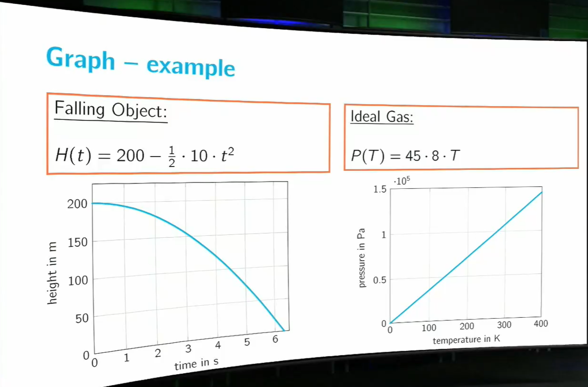

### Welcome to the first week of Calculus I
This week is all about **functions**. We will introduce this fundamental concept that we will be studying throughout the course.

What we will encounter in this week:

- Definition of a function
- Vertical line test
- Formula for a function
- Graph of a function
- Domain, range and codomain
- Inverse functions
- Composition of functions
- Inverse trigonometric functions

At the end of the week we will be able to find formulas for inverse functions, find the maximal domain for a given formula, determine if a function is invertible and simplify compositions of (inverse) trigonometric functions. 

## Introduction to Functions
Functions are the basic building blocks of calculus and in order to use and analyze them we must first define what we mean by a function. We will do so in this first section. We will pay particular attention to how we may represent functions and their domain and range. Finally we will show how one can represent new, more complex functions by combining several simple functions. The concepts covered this week should be familiar from pre-university education. However, we take special care to make sure we are all on the same page regarding notation and interpretation.

The following concepts are introduced in this section:

- definition of a function
- formula for a function
- graph of a function
- vertical line test
- domain, codomain and range
- maximal domain
- product of functions
- composition of functions

### What is a function?

**Definition:**

A function $f: \R \longrightarrow \R $ associates to each number $x$ in its domain exactly one number $f(x)$

**Example**:

$H: \R \longrightarrow \R$ associates to each number $t > 0$ the height of a falling object $t$ seconds after it was dropped.

$P: \R \longrightarrow \R$ associates to each number $T \ge 0$ the pressure of an ideal gas at temperature $T$ Kelvins.

**Formula**

<u>Falling Object</u>:
$$ H(t) = h - \frac{1}{2}gt^2$$

<u>Ideal Gas</u>:
$$ P(T) = \frac{nRT}{V} $$

**Formula - example**

<u>Falling Object</u>:
$$ H(t) = h - \frac{1}{2}gt^2$$

So,  for $h = 200 m$ and $g=10m/s^2$,

$$ H(5) = 200 - \frac{1}{2}\cdot10\cdot 5^2 =  75$$

$$ H(3) = 200 - \frac{1}{2}\cdot10\cdot 3^2 =  155$$

**Graph**

**Definition:**

The graph of a function $f: \R \longrightarrow \R $ is the curve going through all the points $(x, f(x))$ for $x$ in the domain of $f$.

