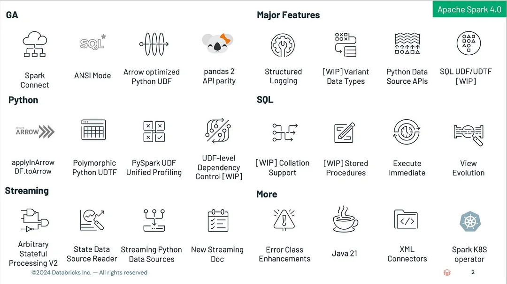

# Links

# [Inspiration](https://www.realtimeperformance.com/5-lessons-from-viktor-frankls-book-mans-search-for-meaning/)

### Fixes
- https://fixes.co.za/
- https://answers.microsoft.com/en-us/windows/forum/all/100-disk-usage-on-windows-10/17e3aa7e-4a2a-4927-97bd-bdb2f7dbe04b

### C Programming
- https://mujoco.readthedocs.io/en/stable/overview.html

## Chemistry
- https://www.rsc.org/periodic-table

## English
- https://www.efset.org/ef-set-50/

## CheatSheets
- https://www.datacamp.com/cheat-sheet

## Linkedin
- [Drone Hacker Tony Fonz] https://www.linkedin.com/in/tonyfonz/

## Learning
- https://www.cloudskillsboost.google/paths
- https://www.udemy.com/course/aws-data-engineer/?couponCode=ST17MT91224B
- https://learn.mongodb.com/
- https://www.pramp.com/
- https://aws.amazon.com/training/learn-about/cloud-practitioner/
- https://d1.awsstatic.com/training-and-certification/docs/AWS_certification_paths.pdf
- https://www.udacity.com/
- https://explore.skillbuilder.aws/learn/course/external/view/elearning/134/aws-cloud-practitioner-essentials

### Syllabus
- [Mechanical Engineering IIT Bombay](https://www.me.iitb.ac.in/academics)
- [BIT Mesra ECE 1st Year Common and 2nd Year Onwards](https://www.bitmesra.ac.in/course/details/1/UG/12)
- [IIITB Cybersecurity ](https://sl-courses.iiitb.ac.in/ice9/pdfs/agenda/IIIT%20B_Advanced%20Executive%20Program%20in%20Cybersecurity.pdf)
- [DIYGuru EV PG Certification](https://diyguru.org/electric-vehicle-pg-certification/)
- [DIYGuru MTech in EVT](https://diyguru.org/adypu-mtech-in-ev/)
-

## Web3
- https://medium.com/@indranil2k316/web-3-0-frontend-development-037f53c93c6a

## ETL
- https://www.datacamp.com/blog/a-list-of-the-16-best-etl-tools-and-why-to-choose-them
- [Process Mining](https://www.celonis.com/process-mining/what-is-process-mining/)
- https://docs.getdbt.com/
- https://learn.getdbt.com/catalog

## Job Board
- https://www.getdbt.com/analytics-engineering/jobs

## APIS

### APISec
- https://www.apisecuniversity.com/

### gRPC
- https://grpc.io/

### GraphQL
- https://graphql.org/community/tools-and-libraries/

### Meta
- https://developers.facebook.com/blog/post/2023/05/16/introducing-stories-publishing-to-the-content-publishing-api-on-instagram/
- https://creatomate.com/how-to/create-instagram-stories-by-api

## CAD/CAE/CAM
- https://www.3ds.com/edu/education/students/solutions/catia-3dx
- https://www.solidworks.com/solution/3dexperience-solidworks-makers
- https://www.solidworks.com/product/students

## Raspbery Pi
- https://www.raspberrypi.org/teach/
- https://www.raspberrypi.org/curriculum
- https://experience-ai.org/en/
- https://www.raspberrypi.org/courses/learn-python
- https://adacomputerscience.org/
- https://codeclub.org/
- https://deepmind.google/

## Testing
- https://www.testim.io/blog/python-test-automation/

## Open Source

### Apache

#### Beam
- https://tour.beam.apache.org/

#### Spark

- [Spark Reddit](https://www.reddit.com/r/apachespark/comments/1drku4i/apache_spark_40_everything_you_must_know/?rdt=60087)

### Python
- https://calmcode.io/course/pytest/package
- https://jinja.palletsprojects.com/en/3.1.x/

### MongoDB
- https://www.mongodb.com/developer/languages/python/python-quickstart-fastapi/
- https://www.mongodb.com/developer/languages/python/python-quickstart-fastapi/

### Linux
- [Linux Device Drivers](https://lwn.net/Kernel/LDD3/)

### Oauth 2.0
- https://github.com/ory/hydra
- https://www.ory.sh/

### Elastic Stack
- https://www.elastic.co/guide/en/elasticsearch/reference/current/docker.html

## AI

### LLM
- https://www.anthropic.com/news/claude-3-5-sonnet
- https://claude.ai/
- https://www.youtube.com/watch?v=8UwhoPOO9I0

## Cybersecurity
- https://www.fortinet.com/
- https://owasp.org/
- https://www.fortinet.com/training-certification
- https://www.fortinet.com/nse-training

## DSA
- https://neetcode.io/

## Electronics
- https://www.sparkfun.com/engineering_essentials

